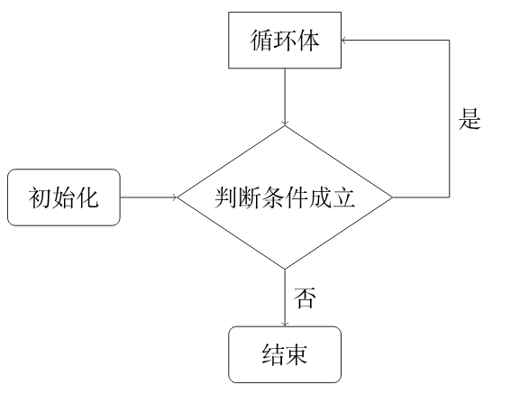
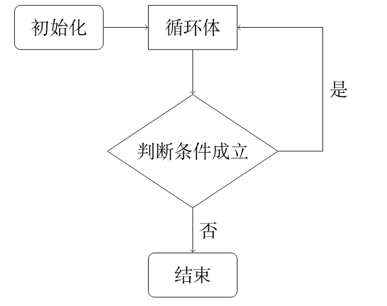
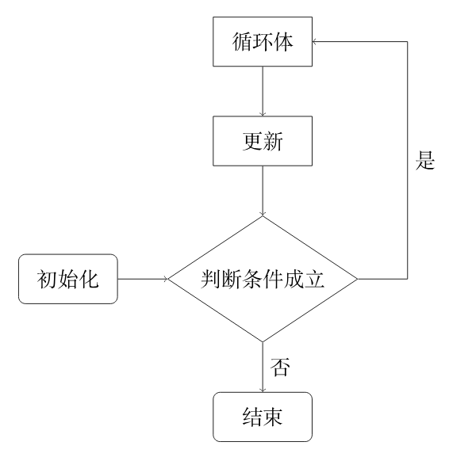

# C++语法基础：基础篇

语言基础简介

本章将会介绍编程相关的知识，C++ 入门教程．

程序是算法与数据结构的载体，是解决 OI 问题的工具．

在 OI 中，最常用的编程语言是 C++．

学习编程是学习 OI 最基础的部分．


## 第1章 输入输出

C++ 是 C 的一个超集，事实上，任何合法的 C 程序都是合法的 C++ 程序（入门阶段可以这么认为）。


### 1.1 基本概念

C++ 是一种静态类型的、**编译式**的、通用的、大小写敏感的、通用的编程语言，支持过程化编程、面向对象编程和泛型编程。

C++ 被认为是一种**中级**语言，它综合了高级语言和低级语言的特点。

C++ 是由 Bjarne Stroustrup 于 1979 年在新泽西州美利山贝尔实验室开始设计开发的。C++ 进一步扩充和完善了 C 语言，最初命名为带类的C，后来在 1983 年更名为 C++。

C++ 是 C 的一个超集，事实上，任何合法的 C 程序都是合法的 C++ 程序。

**注意：**使用静态类型的编程语言是在编译时执行类型检查，而不是在运行时执行类型检查。

##### 1.1.1 面向对象程序设计

C++ 完全支持面向对象的程序设计，包括面向对象开发的四大特性：

+ 抽象 （如果是三大特性就没有 抽象）

+ 封装
+ 继承
+ 多态

减少代码量/提高复用性

##### 1.1.2 标准库

标准的 C++ 由三个重要部分组成：

+ 核心语言，提供了所有构件块，包括变量、数据类型和常量，等等。
+ C++ 标准库，提供了大量的函数，用于操作文件、字符串等。
+ 标准模板库（STL），提供了大量的方法，用于操作数据结构等。

##### 1.1.3 ANSI 标准以及ISO C++

ANSI 标准是为了确保 C++ 的便携性 —— 您所编写的代码在 Mac、UNIX、Windows、Alpha 计算机上都能通过编译。

由于 ANSI 标准已稳定使用了很长的时间，所有主要的 C++ 编译器的制造商都支持 ANSI 标准。

现在 C++ 标准由 ISO 维护（如 C++11、C++14、C++17、C++20 等），ANSI 标准已过时。

##### 1.1.4 学习 C++

学习 C++，关键是要理解概念，而不应过于深究语言的技术细节。

学习程序设计语言的目的是为了成为一个更好的程序员，也就是说，是为了能更有效率地设计和实现新系统，以及维护旧系统。

C++ 支持多种编程风格。您可以使用 Fortran、C、Smalltalk 等任意一种语言的编程风格来编写代码。每种风格都能有效地保证运行时间效率和空间效率。

##### 1.1.5 C++ 的使用

基本上每个应用程序领域的程序员都有使用 C++。

C++ 通常用于编写设备驱动程序和其他要求实时性的直接操作硬件的软件。

C++ 广泛用于教学和研究。

任何一个使用苹果电脑或 Windows PC 机的用户都在间接地使用 C++，因为这些系统的主要用户接口是使用 C++ 编写的。


### 1.2 C++程序框架

基本概念部分我们只需要记住：面向对象的、编译式、的高级编程语言

```c++
#include <iostream>
using namespace std;

int main()
{
    
    return 0;
}
```


#### 1.2.1 程序框架意义

1、 #  --  预处理指令 

2、 include -- 包含、包括

3、 <> -- 放头文件

4、 iostream 头文件

i -- in -- 输入

o -- out -- 输出

stream -- 流

5、

using -- use -- 使用

namespace -- 命名空间

std -- standard -- 标准

; -- 结束（相当于句号）

6、 int main() -- 主函数 -- 程序的入口 -- 开始

int -- 返回类型

main -- 函数名 -- 主要的

（） -- 放传入参数

{} -- 复合语句

7、 return 0; -- 返回一个0 代表程序正常结束

  主函数main 和 return 返还值 0表示没有错误，非0的一般由系统定义，通常指出系统错误。

#### 1.2.2 程序框架意义2

接下来我们讲解一下上面这段程序：

- C++ 语言定义了一些头文件，这些头文件包含了程序中必需的或有用的信息。上面这段程序中，包含了头文件 **\<iostream\>**。
- 行 **using namespace std;** 告诉编译器使用 std 命名空间。命名空间是 C++ 中一个相对新的概念。
- 下一行 **main() 是程序开始执行的地方** 。
- 下一行 **int main()** 是主函数，程序从这里开始执行。
- 下一行 **cout << "Hello World";** 会在屏幕上显示消息 "Hello World"。
- 下一行 **return 0;** 终止 main( )函数，并向调用进程返回值 0。


### 1.3 初识C++的输入输出

#### 1.3.1 C++输入输出库

  C++语言并未定义任何输入输出（IO）语句，取而代之，包含了一个全面的标准库来提供IO机制（以及很多其他设施），本章只了解一部分基本概念和操作。


#### 1.3.2 C++输入

1. cin为istream类型的对象，这个对象也被称为==**标准输入**==。
2. cout为ostream类型的对象，这个对象也被称为==**标准输出**==。

  系统通常会将程序运行的窗口与这些对象联系起来。因此，当我们通过cin，数据将从程序正在运行的窗口读入，当我们像cout写入数据时，将会写到同一个窗口。

cin --- 我们可以认为是 c++ 的 in (输入)

cout 就是 c++ 的 out (输出)


#### 1.3.3 C++输出

​     想要使用输入出输出（iostream）库必须要添加一个**头文件**（header）#include指令必须出现在所有函数之外。一般将一个程序的所有#include指令都放在完文件的开始。


#### 1.3.4 输出hello world

```c++
#include<iostream>
using namespace std;

int main()
{
    cout << "Hello World!" << endl;
    
    return 0;
}
```

  其中main的函数体中只有一条语句cout。

```c++
cout << "Hello World!" << endl;
```

 这条语句使用了**输出运算符**（<<）在标准输出上打印消息。

 << 运算符接受两个运算对象：

   + **左侧**：运算对象必须是一个ostream对象。

   + **右侧**：运算对象为要打印的值。

  此运算符将给定的值写到给定的ostream（**左侧**）对象中，输出运算符的计算结果就是其左侧运算对象（ostream）。

```c++
cout << "Hello World!" << endl;
```

  第一个输出运算符是打印一条消息，这个消息是一个**字符串字面值常量**。

**字符串字面值常量**：是一对用双引号包围的字符序列，在双引号之间的文本被打印到标准输出。

  第二个输出运算符打印endl，这是一个被称为**操纵符**的特殊值。

end --结束

l -- line -- 行、线

**操纵符**：是为了结束当前行（相当于换行），并将与设备关联的缓冲区中的内容冲刷到设备中。


#### 1.3.5 使用标准库中的名字

```c++
using namespace std;
```

  这句话指出cout和endl等是定义在名为std的**命名空间**。

**命名空间**： 可以帮助我们避免不经意的名字定义冲突，以及使用库中相同名字导致的冲突。标准库定义的所有名字都在命名空间std中。

  通过标准空间使用标准库有一个副作用，当使用标准库中的一个名字时，必须显式说明我们想使用来自命名空间std中的名字。

```c++
std::cout << "Hello World!" << std::endl;
```

通过（::）**作用域运算符**来指出我们想使用的定义在命名空间std中的名字cout

而使用

```c++
using namespace std;
```

  写在开头可以省略std:: 


### 1.4 注释

#### 1.4.1 注释简介

  注释是用于解释代码段的意思便于读者理解，但是编译器会忽视。


#### 1.4.2 C++注释种类

  c++中注释有两种：**单行注释**和**多行注释**

1. 单行注释

   以双斜线（//）开始，以换行符结束。

   也就是说当前行双斜线右侧的所有内容都会被编译器忽略。

   这种注释可以包括任何文本。

   常用于半行和单行注释

2. 多行注释

   这种注释继承于C语言的两个定界符（/\* 和 \*/）。这种注释以 /\* 开始，以 \*/ 结束，可以包含除了 \*/ 之外的所有内容（包括换行符）。编译器会将（/\* 和 \*/）中的所有内容忽略。

​       常用于多行注释，注释时不能嵌套。

```c++
#include<iostream>

// 这是单行注释

/*
*   
* 简单主函数
* 常用*号分行
*
*/
```


### 1.5 题目

hello world

https://www.luogu.com.cn/problem/B2002

字符菱形

https://www.luogu.com.cn/problem/B2025

超级玛丽

https://www.luogu.com.cn/problem/P1000


## 第2章 变量和输入

### 2.1 基本数据类型

#### 2.1.1 C++ 数据类型

使用编程语言进行编程时，需要用到各种变量来存储各种信息。变量保留的是它所存储的值的内存位置。这意味着，当您创建一个变量时，就会在内存中保留一些空间。

您可能需要存储各种数据类型（比如字符型、宽字符型、整型、浮点型、双浮点型、布尔型等）的信息，操作系统会根据变量的数据类型，来分配内存和决定在保留内存中存储什么。


#### 2.1.2 基本的内置类型

C++ 为程序员提供了种类丰富的内置数据类型和用户自定义的数据类型。下表列出了七种基本的 C++ 数据类型：

| 类型     | 关键字  |
| :------- | :------ |
| 布尔型   | bool    |
| 字符型   | char    |
| 整型     | int     |
| 浮点型   | float   |
| 双浮点型 | double  |
| 无类型   | void    |
| 宽字符型 | wchar_t |

其实 wchar_t 是这样来的：

```c++
typedef short int wchar_t;
```

所以 wchar_t 实际上的空间是和 short int 一样（取决于计算机）。

一些基本类型可以使用一个或多个类型修饰符进行修饰：

+ signed
+ unsigned
+ short
+ long

下表显示了各种变量类型在内存中存储值时需要占用的内存，以及该类型的变量所能存储的最大值和最小值。

**注意：**不同系统会有所差异，一字节为 8 位。

**注意：**默认情况下，int、short、long都是带符号的，即 signed。

**注意：**long int 8 个字节，int 都是 4 个字节，早期的 C 编译器定义了 long int 占用 4 个字节，int 占用 2 个字节，新版的 C/C++ 标准兼容了早期的这一设定。

| 类型               | 位            | 范围                                                         |
| :----------------- | :------------ | :----------------------------------------------------------- |
| char               | 1 个字节      | -128 到 127 或者 0 到 255                                    |
| unsigned char      | 1 个字节      | 0 到 255                                                     |
| signed char        | 1 个字节      | -128 到 127                                                  |
| int                | 4 个字节      | -2147483648 到 2147483647                                    |
| unsigned int       | 4 个字节      | 0 到 4294967295                                              |
| signed int         | 4 个字节      | -2147483648 到 2147483647                                    |
| short int          | 2 个字节      | -32768 到 32767                                              |
| unsigned short int | 2 个字节      | 0 到 65,535                                                  |
| signed short int   | 2 个字节      | -32768 到 32767                                              |
| long int           | 8 个字节      | -9,223,372,036,854,775,808 到 9,223,372,036,854,775,807      |
| signed long int    | 8 个字节      | -9,223,372,036,854,775,808 到 9,223,372,036,854,775,807      |
| unsigned long int  | 8 个字节      | 0 到 18,446,744,073,709,551,615                              |
| float              | 4 个字节      | 精度型占4个字节（32位）内存空间，+/- 3.4e +/- 38 (~7 个数字) |
| double             | 8 个字节      | 双精度型占8 个字节（64位）内存空间，+/- 1.7e +/- 308 (~15 个数字) |
| long double        | 16 个字节     | 长双精度型 16 个字节（128位）内存空间，可提供18-19位有效数字。 |
| wchar_t            | 2 或 4 个字节 | 1 个宽字符                                                   |

> 注意，各种类型的存储大小与系统位数有关，但目前通用的以64位系统为主。
>
> 以下列出了32位系统与64位系统的存储大小的差别（windows 相同）：
>
> 

从上表可得知，变量的大小会根据编译器和所使用的电脑而有所不同。

下面实例会输出您电脑上各种数据类型的大小。

#### 2.1.3 实例

```c++
#include<iostream>  
#include <limits>
 
using namespace std;  
  
int main()  
{  
    cout << "type: \t\t" << "************size**************"<< endl;  
    cout << "bool: \t\t" << "所占字节数：" << sizeof(bool);  
    cout << "\t最大值：" << (numeric_limits<bool>::max)();  
    cout << "\t\t最小值：" << (numeric_limits<bool>::min)() << endl;  
    cout << "char: \t\t" << "所占字节数：" << sizeof(char);  
    cout << "\t最大值：" << (numeric_limits<char>::max)();  
    cout << "\t\t最小值：" << (numeric_limits<char>::min)() << endl;  
    cout << "signed char: \t" << "所占字节数：" << sizeof(signed char);  
    cout << "\t最大值：" << (numeric_limits<signed char>::max)();  
    cout << "\t\t最小值：" << (numeric_limits<signed char>::min)() << endl;  
    cout << "unsigned char: \t" << "所占字节数：" << sizeof(unsigned char);  
    cout << "\t最大值：" << (numeric_limits<unsigned char>::max)();  
    cout << "\t\t最小值：" << (numeric_limits<unsigned char>::min)() << endl;  
    cout << "wchar_t: \t" << "所占字节数：" << sizeof(wchar_t);  
    cout << "\t最大值：" << (numeric_limits<wchar_t>::max)();  
    cout << "\t\t最小值：" << (numeric_limits<wchar_t>::min)() << endl;  
    cout << "short: \t\t" << "所占字节数：" << sizeof(short);  
    cout << "\t最大值：" << (numeric_limits<short>::max)();  
    cout << "\t\t最小值：" << (numeric_limits<short>::min)() << endl;  
    cout << "int: \t\t" << "所占字节数：" << sizeof(int);  
    cout << "\t最大值：" << (numeric_limits<int>::max)();  
    cout << "\t最小值：" << (numeric_limits<int>::min)() << endl;  
    cout << "unsigned: \t" << "所占字节数：" << sizeof(unsigned);  
    cout << "\t最大值：" << (numeric_limits<unsigned>::max)();  
    cout << "\t最小值：" << (numeric_limits<unsigned>::min)() << endl;  
    cout << "long: \t\t" << "所占字节数：" << sizeof(long);  
    cout << "\t最大值：" << (numeric_limits<long>::max)();  
    cout << "\t最小值：" << (numeric_limits<long>::min)() << endl;  
    cout << "unsigned long: \t" << "所占字节数：" << sizeof(unsigned long);  
    cout << "\t最大值：" << (numeric_limits<unsigned long>::max)();  
    cout << "\t最小值：" << (numeric_limits<unsigned long>::min)() << endl;  
    cout << "double: \t" << "所占字节数：" << sizeof(double);  
    cout << "\t最大值：" << (numeric_limits<double>::max)();  
    cout << "\t最小值：" << (numeric_limits<double>::min)() << endl;  
    cout << "long double: \t" << "所占字节数：" << sizeof(long double);  
    cout << "\t最大值：" << (numeric_limits<long double>::max)();  
    cout << "\t最小值：" << (numeric_limits<long double>::min)() << endl;  
    cout << "float: \t\t" << "所占字节数：" << sizeof(float);  
    cout << "\t最大值：" << (numeric_limits<float>::max)();  
    cout << "\t最小值：" << (numeric_limits<float>::min)() << endl;  
    cout << "size_t: \t" << "所占字节数：" << sizeof(size_t);  
    cout << "\t最大值：" << (numeric_limits<size_t>::max)();  
    cout << "\t最小值：" << (numeric_limits<size_t>::min)() << endl;  
    cout << "string: \t" << "所占字节数：" << sizeof(string) << endl;  
    // << "\t最大值：" << (numeric_limits<string>::max)() << "\t最小值：" << (numeric_limits<string>::min)() << endl;  
    cout << "type: \t\t" << "************size**************"<< endl;  
    return 0;  
}
本实例使用了 endl，这将在每一行后插入一个换行符，<< 运算符用于向屏幕传多个值，sizeof() 函数用来获取各种数据类型的大小。

当上面的代码被编译和执行时，它会产生以下的结果，结果会根据所使用的计算机而有所不同：
```

本实例使用了 **endl**，这将在每一行后插入一个换行符，**<<** 运算符用于向屏幕传多个值，**sizeof()** 函数用来获取各种数据类型的大小。

当上面的代码被编译和执行时，它会产生以下的结果，结果会根据所使用的计算机而有所不同：

```c++
type:         ************size**************
bool:         所占字节数：1    最大值：1        最小值：0
char:         所占字节数：1    最大值：        最小值：?
signed char:     所占字节数：1    最大值：        最小值：?
unsigned char:     所占字节数：1    最大值：?        最小值：
wchar_t:     所占字节数：4    最大值：2147483647        最小值：-2147483648
short:         所占字节数：2    最大值：32767        最小值：-32768
int:         所占字节数：4    最大值：2147483647    最小值：-2147483648
unsigned:     所占字节数：4    最大值：4294967295    最小值：0
long:         所占字节数：8    最大值：9223372036854775807    最小值：-9223372036854775808
unsigned long:     所占字节数：8    最大值：18446744073709551615    最小值：0
double:     所占字节数：8    最大值：1.79769e+308    最小值：2.22507e-308
long double:     所占字节数：16    最大值：1.18973e+4932    最小值：3.3621e-4932
float:         所占字节数：4    最大值：3.40282e+38    最小值：1.17549e-38
size_t:     所占字节数：8    最大值：18446744073709551615    最小值：0
string:     所占字节数：24
type:         ************size**************
```

#### 2.1.4 typedef 声明(选学)

您可以使用 **typedef** 为一个已有的类型取一个新的名字。下面是使用 typedef 定义一个新类型的语法：

```c++
typedef type newname; 
```

例如，下面的语句会告诉编译器，feet 是 int 的另一个名称：

```c++
typedef int feet;
```

现在，下面的声明是完全合法的，它创建了一个整型变量 distance：

```c++
feet a = 5;
```


#### 2.1.5 类型别名 C++11之后

与typedef很类似

```c++
using newname = type;
```

更推荐使用 `using` 的方法`typedef`是C语言遗留下来的，using可以用于模版中，更符合c++赋值逻辑

通常用来 减少代码书写量例如

```c++
unsigned long long int a = 5;
using ll = unsigned long long int;
ll b = 6; // 简化代码
```


#### 2.1.6 计算机单位

计算机中最小单位是 位，又称比特（bit, binary digit）。

计算机中的基本单位是 字节，1 字节（byte）包含 8 比特，字节是描述存储容量的基本单位。

字（word）是计算机进行数据处理和运算的单位，1 字节中包含的二进制位数称为字长，**不是一个永远固定的长度**，而是和计算机字长、机器结构有关。在不同机器里，一个字可能是 16 位、32 位、64 位。

```cpp
1 Byte = 8 bit

1 KB = 1024 Byte

1 MB = 1024 KB

1 GB = 1024 MB
    
小写 b 常表示 bit
大写 B 常表示 Byte
```


### 2.2 变量

变量的概念：存储数据的容器，可以改变

#### 2.2.1 定义

变量定义就是告诉编译器在何处创建变量的存储，以及如何创建变量的存储。

定义一个变量：

格式 ： 数据类型 变量名称；

例如:

```c++
int a;
```

创建一个名字叫做 a 的 整数类型(简称整形)（int)  的 变量

其余类型变量也是类似格式

```c++
long long int b;
char c;
float d;
double e;
```

数据类型必须是一个有效的 C++ 数据类型

相同类型的多个变量可以连续定义

```c++
int i, j, k, l, m, n;
```


#### 2.2.2 赋值

从右往左赋值

左侧放变量名 赋值符号 =  右侧放值

```c++
int a;
a = 5;

char c;
c = 'b';

bool b;
b = true;
```

什么类型的变量 存储对应 的数据

如果随意赋值会产生数据类型转换

```c++
int a;
a = 3.1415;
cout << a;
```

连续赋值

```c++
int a, b, c, d;
a = b = c = d = 6;
```


#### 2.2.3 初始化

定义的同时进行赋值的操作叫做初始化

定义 + 赋值 = 初始化

```c++
int a = 10;
double b = 3.1415;
```

如果不进行初始化 将会得到一个随机数据

```c++
int a;
cout << a;

double b;
cout << b;
```


#### 2.2.4 变量名命名规则

标识符命名规则（变量名、函数名、结构体名、数组名）

1、只能由 26个字母区分大小写 以及  0~9 数字 和 下划线_ 组成

2、不能以数字开头

3、不能使用关键字（保留字）（cout不是关键字，int Int;）

```c++
int a1, a2, a3;
int myName;
int _apple;
int my_apple_1;
// 以上这些都可以

int 1a;
int int;
int my&*;
//这些都不可以
```

###### 通用命名

| 变量名称  | 单词全拼  | 使用场景                                |
| :-------- | :-------- | :-------------------------------------- |
| `a, b, c` |           | 通用变量名, 数组一般建议int a[110];     |
| `n, m`    |           | n 个数，n 行 m 列                       |
| `x, y`    |           | 未知数，坐标，行列坐标                  |
| `ma, mi`  |           | 最大值，最小值                          |
| `i, j, k` |           | for 循环结构使用                        |
| `last`    |           | 上一个访问的元素                        |
| `ans`     | answer    | 答案                                    |
| `ret`     | result    | 答案                                    |
| `cnt`     | count     | 计数器，`int cnt = 0;`（注意初始化成0） |
| `sum`     | summation | 求和，`int sum = 0;`（注意初始化成0）   |
| `num`     | number    | 数字                                    |
| `tmp`     | temp      | 存储临时数据                            |
| `s`       | string    | 字符串                                  |
| `c`       | char      | 字符                                    |
| `pos`     | position  | 位置                                    |
| `dis`     | distance  | 距离                                    |
| `cur`     |           | 当前的                                  |
| `now`     |           | 当前的                                  |
| `st`      | start     | 开始                                    |
| `ed`      | end       | 结束                                    |


### 2.3 C++ 关键字

下表列出了 C++ 中的保留字。这些保留字不能作为常量名、变量名或其他标识符名称。

devc++中加黑加粗的词

| asm          | else      | new              | this     |
| ------------ | --------- | ---------------- | -------- |
| auto         | enum      | operator         | throw    |
| bool         | explicit  | private          | true     |
| break        | export    | protected        | try      |
| case         | extern    | public           | typedef  |
| catch        | false     | register         | typeid   |
| char         | float     | reinterpret_cast | typename |
| class        | for       | return           | union    |
| const        | friend    | short            | unsigned |
| const_cast   | goto      | signed           | using    |
| continue     | if        | sizeof           | virtual  |
| default      | inline    | static           | void     |
| delete       | int       | static_cast      | volatile |
| do           | long      | struct           | wchar_t  |
| double       | mutable   | switch           | while    |
| dynamic_cast | namespace | template         |          |


### 2.4 输入

通过键盘读取数据存入到指定变量中的过程叫做输入

```c++
int a;
cin >> a;
```

cin 表示c++的输入 >> 输入运算符 与 输出相反需要注意

如有多个变量可以进行连续输入

```c++
int a, b, c, d, e;
cin >> a >> b >> c >> d >> e;
```

通过键盘输入时可以利用空格或回车隔开各个数据

因为cin使用空格或回车作为数据分隔符


### 2.5 scanf 与 printf

`scanf` 与 `printf` 其实是 C 语言提供的函数．大多数情况下，它们的速度比 `cin` 和 `cout` 更快，并且能够方便地控制输入输出格式．

```c++
#include <cstdio> // 头文件

int main() 
{
  int x, y;
  scanf("%d%d", &x, &y);   // 读入 x 和 y
  printf("%d\n%d", y, x);  // 输出 y，换行，再输出 x
    
  return 0;
}
```

其中，`%d` 表示读入/输出的变量是一个有符号整型（`int` 型）的变量．

类似地：

1. `%s` 表示字符串．
2. `%c` 表示字符．
3. `%lf` 表示双精度浮点数 (`double`)．
4. `%lld` 表示长整型 (`long long`)．根据系统不同，也可能是 `%I64d`．
5. `%u` 表示无符号整型 (`unsigned int`)．
6. `%llu` 表示无符号长整型 (`unsigned long long`)，也可能是 `%I64u`．

除了类型标识符以外，还有一些控制格式的方式．许多都不常用，选取两个常用的列举如下：

1. `%1d` 表示最小宽度为 1 的整型．在读入时，即使没有空格也可以逐位读入数字．在输出时，若指定的长度大于数字的位数，就会在数字前用空格填充．若指定的长度小于数字的位数，就没有效果．
2. `%.6lf`，用于输出，保留六位小数．

这两种运算符的相应地方都可以填入其他数字，例如 `%.3lf` 表示保留三位小数．


### 2.6 输出格式控制

scanf和printf是C语言继承下来的

c++也有控制格式输出的方式

需要头文件 iomanip(io 输入输出 manip 操纵控制)

#### 2.6.1 保留小数

```c++
#include <iomanip>

double a = 3.14159;

cout << fixed << setprecision(3) << a;
```

set -- 设置

precision -- 精度

setprecision(n) 保留小数点后n位

设置好之后对后面所有的变量都有效


#### 2.6.2 控制宽度

```c++
int a = 5;
cout << setw(5) << a;
```

setw(n) 控制宽度为n 位

如果数本身超过n 则不起作用

可以配合填充字符使用

```c++
int a = 5;
cout << setw(2) << setfill('0') << a;
```

setw默认右对齐可以通过left和right调整

```c++ 
cout << left << setw(2) << setfill('0') << a;
```

并且只能控制紧跟着的一个变量

如果有多个变量控制需要写多次


### 2.7 数据类型转换

在 C++ 中，不同的数据类型之间可以进行转换。转换分为两大类：**隐式转换**（由编译器自动完成）和**显式转换**（强制转换，由程序员明确指定）。

#### 2.7.1 隐式转换

当表达式中出现混合类型，或者将一种类型的值赋给另一种类型的变量时，C++ 编译器会自动执行隐式类型转换。隐式转换遵循**“提升”**原则：小类型向大类型转换，以避免数据丢失。


##### 常见的隐式转换场景

1. **算术运算中的类型提升**
   在二元运算符（如 `+`, `-`, `*`, `/`）中，两个操作数会被转换为同一类型，规则通常按“**算术转换**”：

   - 如果任一操作数为 `long double`，另一操作数转换为 `long double`。
   - 否则，如果任一操作数为 `double`，另一操作数转换为 `double`。
   - 否则，如果任一操作数为 `float`，另一操作数转换为 `float`。
   - 否则，进行**整型提升**（`bool`、`char`、`short` 等提升为 `int`），然后按 `long long` → `long` → `int` 的优先级统一类型。

   ```c++
   int a = 5;
   double b = 2.5;
   auto c = a + b;   // a 被隐式转换为 double，结果 c 为 double (7.5)
   ```
   
   
   
2. **赋值时的转换**
   将一种类型赋值给另一种类型的变量时，编译器会把右侧的值转换为左侧变量的类型。如果转换可能丢失精度（如 `double` 赋值给 `int`），编译器会给出警告但不报错。

   ```c++
   int i = 3.14;     // 隐式转换，i 被赋值为 3（截断小数）
   double d = 5;     // 5 隐式转换为 5.0
   ```
   
   
   
3. **函数调用参数传递**
   实参传递给形参时，如果类型不匹配，编译器会尝试隐式转换。

   ```c++
   void func(double x) { }
   func(10);          // int 隐式转换为 double
   ```
   
   
   
4. **返回值类型转换**
   `return` 语句中的表达式类型与函数声明的返回类型不一致时，会发生隐式转换。

   ```c++
   int getValue() {
       return 3.14;   // 隐式转换为 int，返回 3
   }
   ```
   
   

##### 隐式转换的风险

- **精度丢失**：`double` → `int` 会截断小数部分。

- **符号扩展问题**：将 `signed char` 转换为 `int` 时，如果原值为负，则高位会填充 `1`（符号扩展）。

- **无符号整数与有符号整数的混合运算**：有符号数会被隐式转换为无符号数，可能导致意外的结果。

  ```c++
  unsigned int u = 10;
  int s = -5;
  if (u > s)        // 由于隐式转换，s 被转换为 unsigned int（变成很大的正数），
                    // 条件实际为 10 > 4294967291，结果为 false！
  

因此，在编写代码时应尽量避免依赖复杂的隐式转换，或通过显式转换明确意图。


#### 2.7.2 显示转换（强制转换）

当隐式转换无法自动发生，或者程序员希望强制改变类型时，可以使用显式转换。C++ 提供了两种风格的强制转换：**C 风格强制转换**和 **C++ 风格强制转换**（推荐使用后者）。

##### 1. C 风格强制转换

语法：`(目标类型) 表达式` 或 `目标类型 (表达式)`

```c++
double pi = 3.14159;
int a = (int)pi;        // C 风格，a = 3
int b = int(pi);        // 函数式风格（也是 C++ 允许的）
```


### 2.8 常量

**常量** 是在程序执行期间值不可改变的量。
C++ 支持多种常量形式：字面常量、`const` 常量、`constexpr` 常量、枚举常量以及宏常量等


#### 2.8.1 字面常量 (Literal Constants)

字面量直接写在代码中，编译器根据书写格式推断类型。

```c++
int a = 123;      // 十进制
int b = 0123;     // 八进制（以0开头）→ 83
int c = 0x123;    // 十六进制 → 291
int d = 0b1101;   // 二进制（C++14起）→ 13

// 后缀控制类型
auto u = 100U;    // unsigned int
auto l = 100L;    // long
auto ll = 100LL;  // long long
auto ul = 100UL;  // unsigned long

// 浮点数常量
double f1 = 3.14;     // 十进制小数
double f2 = 3.14e-2;  // 科学记数法 → 0.0314
float f3 = 3.14f;     // float (F/f后缀)
long double f4 = 3.14L; // long double

// 字符常量
char c1 = 'A';                 // 普通字符
char c2 = '\n';                // 转义字符
char c3 = '\x41';              // 十六进制ASCII → 'A'
wchar_t wc = L'あ';            // 宽字符
char16_t u16 = u'あ';          // UTF-16 (C++11)
char32_t u32 = U'あ';          // UTF-32 (C++11)
char8_t u8 = u8'A';            // UTF-8 (C++20)
```


#### 2.8.2 const 常量

`const` 修饰的变量**必须初始化**，之后不可修改。

```c++
const int DAYS_IN_WEEK = 7;
DAYS_IN_WEEK = 8;  // ❌ 错误：只读变量不可赋值

// const 对象必须初始化
const int x;       // ❌ 错误：未初始化

// 指针与 const 组合
int a = 5;
const int* p = &a;   // 指向常量的指针：不能通过 p 修改 a
int* const q = &a;   // 常量指针：q 不能再指向其他地址
const int* const r = &a; // 既指向常量又是常量指针
```


#### 2.8.3 宏常量 (旧式 C 风格）

`#define` 预处理宏不是真正的常量，只是文本替换，**不推荐**在 C++ 中使用。

```c++
#define MAX_SIZE 100   // 预处理阶段替换
int arr[MAX_SIZE];

// 缺点：无类型检查，作用域污染，调试困难
#define SQUARE(x) ((x)*(x))  // 参数宏容易出错
// 建议用 constexpr 或 const 代替
```


#### 2.8.4 constexpr 常量 (C++11) (可选)

```c++
constexpr int SIZE = 100;           // 编译期常量
constexpr double PI = 3.1415926;

int arr[SIZE];                      // 合法

// constexpr 函数（编译期可算）
constexpr int square(int n) {
    return n * n;
}
int arr2[square(5)];                // 25 个元素的数组

// 区别：const 可以是运行时初始化的只读变量
int n;
std::cin >> n;
const int c = n;        // ✅ 允许，但只是运行时只读
// constexpr int ce = n;  // ❌ 错误，n 不是编译期常量
```


### 2.9 题目

a+b

https://www.luogu.com.cn/problem/P1001

字符三角形

https://www.luogu.com.cn/problem/B2005

苹果采购

https://www.luogu.com.cn/problem/P5703


## 第3章 运算符和表达式

### 3.1 算术运算符

下表显示了 C++ 支持的算术运算符。

假设变量 A 的值为 10，变量 B 的值为 20，则：

| 运算符 | 描述                             | 实例             |
| :----- | :------------------------------- | :--------------- |
| +      | 把两个操作数相加                 | A + B 将得到 30  |
| -      | 从第一个操作数中减去第二个操作数 | A - B 将得到 -10 |
| *      | 把两个操作数相乘                 | A * B 将得到 200 |
| /      | 分子除以分母                     | B / A 将得到 2   |
| %      | 取模运算符，整除后的余数         | B % A 将得到 0   |
| ++     | 自增运算符，整数值增加 1         | A++ 将得到 11    |
| --     | 自减运算符，整数值减少 1         | A-- 将得到 9     |

样例

```c++
#include <iostream>
using namespace std; 

int main(){
   int a = 21;   
    int b = 10;   
    int c ; 
    c = a + b;   
    cout << "Line 1 - c 的值是 " << c << endl;
    c = a - b;   
    cout << "Line 2 - c 的值是 " << c << endl;
    c = a * b;  
    cout << "Line 3 - c 的值是 " << c << endl;   
    c = a / b;   
    cout << "Line 4 - c 的值是 " << c << endl;   
    c = a % b;   
    cout << "Line 5 - c 的值是 " << c << endl ; 
    int d = 10;   //  测试自增、自减
    c = d++;   
    cout << "Line 6 - c 的值是 " << c << endl ; 
    d = 10;    // 重新赋值
    c = d--;  
    cout << "Line 7 - c 的值是 " << c << endl;   
    
    return 0;
}
```


### 3.2 比较运算符

下表显示了 C++ 支持的关系运算符。

假设变量 A 的值为 10，变量 B 的值为 20，则：

| 运算符 | 描述                                                         | 实例              |
| :----- | :----------------------------------------------------------- | :---------------- |
| ==     | 检查两个操作数的值是否相等，如果相等则条件为真。             | (A == B) 不为真。 |
| !=     | 检查两个操作数的值是否相等，如果不相等则条件为真。           | (A != B) 为真。   |
| >      | 检查左操作数的值是否大于右操作数的值，如果是则条件为真。     | (A > B) 不为真。  |
| <      | 检查左操作数的值是否小于右操作数的值，如果是则条件为真。     | (A < B) 为真。    |
| >=     | 检查左操作数的值是否大于或等于右操作数的值，如果是则条件为真。 | (A >= B) 不为真。 |
| <=     | 检查左操作数的值是否小于或等于右操作数的值，如果是则条件为真。 | (A <= B) 为真。   |

样例

```c++
#include <iostream>
using namespace std;

int main(){
   int a = 21;   int b = 10;   int c ; 
   if( a == b )
   {
      cout << "Line 1 - a 等于 b" << endl ;   }
   else
   {
      cout << "Line 1 - a 不等于 b" << endl ;   }
   if ( a < b )
   {
      cout << "Line 2 - a 小于 b" << endl ;   }
   else
   {
      cout << "Line 2 - a 不小于 b" << endl ;   }
   if ( a > b )
   {
      cout << "Line 3 - a 大于 b" << endl ;   }
   else
   {
      cout << "Line 3 - a 不大于 b" << endl ;   }
   /* 改变 a 和 b 的值 */
   a = 5;   b = 20;   if ( a <= b )
   {
      cout << "Line 4 - a 小于或等于 b" << endl ;   }
   if ( b >= a )
   {
      cout << "Line 5 - b 大于或等于 a" << endl ;   }
   return 0;
}
```


### 3.3 逻辑运算符

下表显示了 C++ 支持的关系逻辑运算符。

假设变量 A 的值为 1，变量 B 的值为 0，则：

| 运算符 | 描述                                                         | 实例              |
| :----- | :----------------------------------------------------------- | :---------------- |
| &&     | 称为逻辑与运算符。如果两个操作数都非零，则条件为真。         | (A && B) 为假。   |
| \|\|   | 称为逻辑或运算符。如果两个操作数中有任意一个非零，则条件为真。 | (A \|\| B) 为真。 |
| !      | 称为逻辑非运算符。用来逆转操作数的逻辑状态。如果条件为真则逻辑非运算符将使其为假。 | !(A && B) 为真。  |

样例

```c++
#include <iostream>
using namespace std; 

int main(){
   int a = 5;   int b = 20;   int c ; 
   if ( a && b )
   {
      cout << "Line 1 - 条件为真"<< endl ;   }
   if ( a || b )
   {
      cout << "Line 2 - 条件为真"<< endl ;   }
   /* 改变 a 和 b 的值 */
   a = 0;   b = 10;   if ( a && b )
   {
      cout << "Line 3 - 条件为真"<< endl ;   }
   else
   {
      cout << "Line 4 - 条件不为真"<< endl ;   }
   if ( !(a && b) )
   {
      cout << "Line 5 - 条件为真"<< endl ;   }
   return 0;
}
```


### 3.4 复合赋值运算

下表列出了 C++ 支持的赋值运算符：

| 运算符 | 描述                                                         | 实例                            |
| :----- | :----------------------------------------------------------- | :------------------------------ |
| =      | 简单的赋值运算符，把右边操作数的值赋给左边操作数             | C = A + B 将把 A + B 的值赋给 C |
| +=     | 加且赋值运算符，把右边操作数加上左边操作数的结果赋值给左边操作数 | C += A 相当于 C = C + A         |
| -=     | 减且赋值运算符，把左边操作数减去右边操作数的结果赋值给左边操作数 | C -= A 相当于 C = C - A         |
| *=     | 乘且赋值运算符，把右边操作数乘以左边操作数的结果赋值给左边操作数 | C *= A 相当于 C = C * A         |
| /=     | 除且赋值运算符，把左边操作数除以右边操作数的结果赋值给左边操作数 | C /= A 相当于 C = C / A         |
| %=     | 求模且赋值运算符，求两个操作数的模赋值给左边操作数           | C %= A 相当于 C = C % A         |

进阶部分


| <<=  | 左移且赋值运算符     | C <<= 2 等同于 C = C << 2 |
| :--- | :------------------- | :------------------------ |
| >>=  | 右移且赋值运算符     | C >>= 2 等同于 C = C >> 2 |
| &=   | 按位与且赋值运算符   | C &= 2 等同于 C = C & 2   |
| ^=   | 按位异或且赋值运算符 | C ^= 2 等同于 C = C ^ 2   |
| \|=  | 按位或且赋值运算符   | C \|= 2 等同于 C = C \| 2 |


### 3.5 位运算 （进阶部分）

位运算符作用于位，并逐位执行操作。&、 | 和 ^ 的真值表如下所示：

| p    | q    | p & q | p \| q | p ^ q |
| :--- | :--- | :---- | :----- | :---- |
| 0    | 0    | 0     | 0      | 0     |
| 0    | 1    | 0     | 1      | 1     |
| 1    | 1    | 1     | 1      | 0     |
| 1    | 0    | 0     | 1      | 1     |


### 3.6 逗号运算符

逗号运算符（`,`）允许在一行中按顺序执行多个表达式，**并返回最后一个表达式的值**。
它的优先级是所有运算符中**最低**的，通常需要配合括号使用。

```c++
#include <iostream>
using namespace std;

int main() {
    int a, b, c;
    
    // 先计算 b=3，再计算 c=4，最后整体值为 b+c (7)
    a = (b = 3, c = 4, b + c);
    cout << a << endl;  // 输出 7
    
    // 括号不可省略，否则赋值优先级更高
    // a = b = 3, c = 4, b + c;    
    // 实际解释为 (a = (b = 3)), c = 4, (b + c)
    
    // for 循环中同时操作多个变量
    for (int i = 0, j = 10; i < j; i++, j--) {
   		cout << "i = " << i << ", j = " << j << endl;
	}
    
    return 0;
}
```
逗号运算符是 C++ 中一个功能有限但特定场景下有用的工具。记住三点：

- 从左到右执行，返回最后一个值。
- 优先级最低，使用括号包围。
- 主要用于 `for` 循环、宏等需要紧凑语法的地方。


### 3.7 表达式和优先级

优先级决定表达式中**哪个运算符先计算**。
例如 `1 + 2 * 3`：乘法优先级高于加法，所以先算 `2*3=6`，再加 `1` 得 `7`。

当优先级相同时，结合性决定计算顺序：

- **左结合**：从左向右计算。如 `a + b - c` 等价于 `(a + b) - c`。
- **右结合**：从右向左计算。如 `a = b = c` 等价于 `a = (b = c)`；`?:` 也是右结合。

```c++
#include <iostream>
using namespace std;

int main() {
    // 示例1：算术与关系优先级
    int x = 5, y = 10;
    bool r = x + 3 > y - 2;   // 等价于 (x+3) > (y-2) → 8>8 → false
    cout << r << endl;        // 输出0

    // 示例2：逻辑与位运算混合
    int a = 2, b = 3;
    int c = a & b + 1;        // 先算 b+1=4，再 a&4 = 0
    cout << c << endl;        // 输出0

    // 示例3：赋值结合性
    int i, j, k;
    i = j = k = 5;            // 右结合：k=5, j=5, i=5
    cout << i << j << k << endl; // 555

    // 示例4：条件运算符优先级
    int m = 2, n = 3;
    int res = m > n ? m : n + 1;  // 等价于 (m>n) ? m : (n+1) → 3+1=4
    cout << res << endl;          // 输出4

    // 示例5：逗号优先级最低
    int z;
    z = (1, 2, 3);            // 括号使逗号先执行，结果为3
    cout << z << endl;        // 3
    // 不加括号：z = 1, 2, 3;  等价于 (z=1), 2, 3 → z=1

    return 0;
}
```


### 3.8 优先级汇总

来自 [C++ 运算符优先级 - cppreference](https://zh.cppreference.com/w/cpp/language/operator_precedence) ，有修改．

|             运算符              |        描述        |                            例子                            | 可重载性 |
| :-----------------------------: | :----------------: | :--------------------------------------------------------: | :------: |
|          **第一级别**           |                    |                                                            |          |
|              `::`               |    作用域解析符    |                     `Class::age = 2;`                      | 不可重载 |
|          **第二级别**           |                    |                                                            |          |
|              `++`               |    后自增运算符    |         `for (int i = 0; i < 10; i++) cout << i;`          |  可重载  |
|              `--`               |    后自减运算符    |         `for (int i = 10; i > 0; i--) cout << i;`          |  可重载  |
|         `type() type{}`         |    强制类型转换    |             `unsigned int a = unsigned(3.14);`             |  可重载  |
|              `()`               |      函数调用      |                       `isdigit('1')`                       |  可重载  |
|              `[]`               |    数组数据获取    |                      `array[4] = 2;`                       |  可重载  |
|               `.`               |   对象型成员调用   |                      `obj.age = 34;`                       | 不可重载 |
|              `->`               |   指针型成员调用   |                      `ptr->age = 34;`                      |  可重载  |
|  **第三级别** （从右向左结合）  |                    |                                                            |          |
|              `++`               |    前自增运算符    |           `for (i = 0; i < 10; ++i) cout << i;`            |  可重载  |
|              `--`               |    前自减运算符    |           `for (i = 10; i > 0; --i) cout << i;`            |  可重载  |
|               `+`               |        正号        |                       `int i = +1;`                        |  可重载  |
|               `-`               |        负号        |                       `int i = -1;`                        |  可重载  |
|               `!`               |      逻辑取反      |                       `if (!done) …`                       |  可重载  |
|               `~`               |      按位取反      |                     `flags = ~flags;`                      |  可重载  |
|            `(type)`             | C 风格强制类型转换 |                 `int i = (int) floatNum;`                  |  可重载  |
|               `*`               |      指针取值      |                   `int data = *intPtr;`                    |  可重载  |
|               `&`               |      值取指针      |                   `int *intPtr = &data;`                   |  可重载  |
|            `sizeof`             |    返回类型内存    |  `int size = sizeof floatNum; int size = sizeof(float);`   | 不可重载 |
|              `new`              |  动态元素内存分配  | `long *pVar = new long; MyClass *ptr = new MyClass(args);` |  可重载  |
|            `new []`             |  动态数组内存分配  |                `long *array = new long[n];`                |  可重载  |
|            `delete`             |  动态析构元素内存  |                       `delete pVar;`                       |  可重载  |
|           `delete []`           |  动态析构数组内存  |                     `delete [] array;`                     |  可重载  |
|          **第四级别**           |                    |                                                            |          |
|              `.*`               |   类对象成员引用   |                      `obj.*var = 24;`                      | 不可重载 |
|              `->*`              |   类指针成员引用   |                     `ptr->*var = 24;`                      |  可重载  |
|          **第五级别**           |                    |                                                            |          |
|               `*`               |        乘法        |                      `int i = 2 * 4;`                      |  可重载  |
|               `/`               |        除法        |                  `float f = 10.0 / 3.0;`                   |  可重载  |
|               `%`               |  取余数（模运算）  |                     `int rem = 4 % 3;`                     |  可重载  |
|          **第六级别**           |                    |                                                            |          |
|               `+`               |        加法        |                      `int i = 2 + 3;`                      |  可重载  |
|               `-`               |        减法        |                      `int i = 5 - 1;`                      |  可重载  |
|          **第七级别**           |                    |                                                            |          |
|              `<<`               |       位左移       |                   `int flags = 33 << 1;`                   |  可重载  |
|              `>>`               |       位右移       |                   `int flags = 33 >> 1;`                   |  可重载  |
|          **第八级别**           |                    |                                                            |          |
|              `<=>`              |   三路比较运算符   |                 `if ((i <=> 42) < 0) ...`                  |  可重载  |
|          **第九级别**           |                    |                                                            |          |
|               `<`               |        小于        |                     `if (i < 42) ...`                      |  可重载  |
|              `<=`               |      小于等于      |                     `if (i <= 42) ...`                     |  可重载  |
|               `>`               |        大于        |                     `if (i > 42) ...`                      |  可重载  |
|              `>=`               |      大于等于      |                     `if (i >= 42) ...`                     |  可重载  |
|          **第十级别**           |                    |                                                            |          |
|              `==`               |        等于        |                     `if (i == 42) ...`                     |  可重载  |
|              `!=`               |       不等于       |                     `if (i != 42) ...`                     |  可重载  |
|         **第十一级别**          |                    |                                                            |          |
|               `&`               |      位与运算      |                   `flags = flags & 42;`                    |  可重载  |
|         **第十二级别**          |                    |                                                            |          |
|               `^`               |     位异或运算     |                   `flags = flags ^ 42;`                    |  可重载  |
|         **第十三级别**          |                    |                                                            |          |
|               `|`               |      位或运算      |                   `flags = flags | 42;`                    |  可重载  |
|         **第十四级别**          |                    |                                                            |          |
|              `&&`               |     逻辑与运算     |            `if (conditionA && conditionB) ...`             |  可重载  |
|         **第十五级别**          |                    |                                                            |          |
|              `||`               |     逻辑或运算     |            `if (conditionA || conditionB) ...`             |  可重载  |
| **第十六级别** （从右向左结合） |                    |                                                            |          |
|              `? :`              |     条件运算符     |                  `int i = a > b ? a : b;`                  | 不可重载 |
|             `throw`             |      异常抛出      |                 `throw EClass("Message");`                 | 不可重载 |
|               `=`               |        赋值        |                        `int a = b;`                        |  可重载  |
|              `+=`               |     加赋值运算     |                         `a += 3;`                          |  可重载  |
|              `-=`               |     减赋值运算     |                         `b -= 4;`                          |  可重载  |
|              `*=`               |     乘赋值运算     |                         `a *= 5;`                          |  可重载  |
|              `/=`               |     除赋值运算     |                         `a /= 2;`                          |  可重载  |
|              `%=`               |     模赋值运算     |                         `a %= 3;`                          |  可重载  |
|              `<<=`              |   位左移赋值运算   |                       `flags <<= 2;`                       |  可重载  |
|              `>>=`              |   位右移赋值运算   |                       `flags >>= 2;`                       |  可重载  |
|              `&=`               |    位与赋值运算    |                   `flags &= new_flags;`                    |  可重载  |
|              `^=`               |   位异或赋值运算   |                   `flags ^= new_flags;`                    |  可重载  |
|              `|=`               |    位或赋值运算    |                   `flags |= new_flags;`                    |  可重载  |
|         **第十七级别**          |                    |                                                            |          |
|               `,`               |     逗号分隔符     |         `for (i = 0, j = 0; i < 10; i++, j++) ...`         |  可重载  |

需要注意的是，表中并未列出 `const_cast`、`static_cast`、`dynamic_cast`、`reinterpret_cast`、`typeid`、`sizeof...`、`noexcept` 及 `alignof` 等运算符，因为它们的使用形式与函数调用相同，不会出现歧义．


## 第4章 分支结构

### 4.1 if语句

#### 4.1.1 单分支语句

基本 if 语句

以下是基本 if 语句的结构:

```c++
if (条件) 
{  
	主体; 
} 
```

if 语句通过对条件进行求值，若结果为真（非 0），执行语句，否则不执行．

如果主体中只有单个语句的话，大括号可以省略．


#### 4.1.2 双分支语句

if...else 语句

```c++
if (条件) 
{  
	主体1; 
} 
else
{  
	主体2; 
} 
```

if...else 语句和 if 语句类似，else 不需要再写条件．当 if 语句的条件满足时会执行 if 里的语句，if 语句的条件不满足时会执行 else 里的语句．同样，当主体只有一条语句时，可以省略大括号．


#### 4.1.3 多分支语句

else if 语句

```c++
if (条件1) 
{  
	主体1; 
} 
else if (条件2) 
{  
	主体2; 
} 
else if (条件3) 
{  
	主体3; 
} 
else 
{  
	主体4; 
} 
```

else if 语句是 if 和 else 的组合，对多个条件进行判断并选择不同的语句分支．在最后一条的 else 语句不需要再写条件．例如，若条件 1 为真，执行主体 1，条件 3 为真而条件 1 和条件 2 都为假，执行主体 3，所有的条件都为假才执行主体 4．

实际上，这一个语句相当于第一个 if 的 else 分句只有一个 if 语句，就将花括号省略之后放在一起了．如果条件相互之间是并列关系，这样写可以让代码的逻辑更清晰．


### 4.2 三目运算符(条件运算符)

条件运算符可以看作 `if` 语句的简写，`a ? b : c` 中如果表达式 `a` 成立，那么这个条件表达式的结果是 `b`，否则条件表达式的结果是 `c`．


### 4.3 switch语句

switch-case语句

```c++
switch (选择句) 
{  
    case 标签1:    
		主体1;  
	case 标签2:    
		主体2;  
	default:    
		主体3; 
} 
```

switch 语句执行时，先求出选择句的值，然后根据选择句的值选择相应的标签，从标签处开始执行．其中，选择句必须是一个整数类型表达式，而标签都必须是整数类型的常量．例如：

```c++
int i = 1;  // 这里的 i 的数据类型是整型 ，满足整数类型的表达式的要求
switch (i) 
{  
    case 1:    
        cout << "OI WIKI" << endl;
} 
```


```c++
char i = 'A'; // 这里的 i 的数据类型是字符型 ，但 char 也是属于整数的类型，满足整数类型的表达式的要求 
switch (i) 
{ 
    case 'A':    
        cout << "OI WIKI" << endl; 
} 
```

switch 语句中还要根据需求加入 break 语句进行中断，否则在对应的 case 被选择之后接下来的所有 case 里的语句和 default 里的语句都会被运行．具体例子可看下面的示例．

```c++
char i = 'B'; 
switch (i)
{  
    case 'A':    
        cout << "OI" << endl;    
        break;   
    case 'B':    
        cout << "WIKI" << endl;   
    default:    
        cout << "Hello World" << endl;
} 
```

以上代码运行后输出的结果为 `WIKI` 和 `Hello World`，如果不想让下面分支的语句被运行就需要 break 了，具体例子可看下面的示例．

```c++
char i = 'B'; 
switch (i) 
{  
    case 'A':    
        cout << "OI" << endl;    
        break;   
    case 'B':    
        cout << "WIKI" << endl;    
        break;   
    default:    
        cout << "Hello World" << endl;
} 
```

以上代码运行后输出的结果为 WIKI，因为 break 的存在，接下来的语句就不会继续被执行了．最后一个语句不需要 break，因为下面没有语句了．

处理入口编号不能重复，但可以颠倒．也就是说，入口编号的顺序不重要．各个 case（包括 default）的出现次序可任意．例如：

```c++
char i = 'B'; 
switch (i) 
{  
    case 'B':    
        cout << "WIKI" << endl;    
        break;   
    default:    
        cout << "Hello World" << endl;    
        break;   
    case 'A':    
        cout << "OI" << endl; 
} 
```

switch 的 case 分句中也可以选择性的加花括号．不过要注意的是，如果需要在 switch 语句中定义变量，花括号是必须要加的．例如：

```c++
char i = 'B'; 
int ans;
switch (i)
{  
    case 'A':
        {    
        int i = 1, j = 2;    
        cout << "OI" << endl;    
        ans = i + j;   
        break; 
        }   
    case 'B': 
        {    
            int qwq = 3;
            cout << "WIKI" << endl;    
            ans = qwq * qwq;   
            break;  
        }   
    default: 
        {    
            cout << "Hello World" << endl; 
        } 
}
```


## 第5章 循环结构一 while

编程中重复的事情

例如 ： 输出100遍 hello world，从100个x相加

可以利用循环解决

### 5.1 while 循环

以下是 while 语句的结构：

```c++
while (判断条件) 
{  
    循环体; 
} 
```

执行顺序：





```c++
#include <iostream>
using namespace std;

int main()
{
    while (true)
    {
        cout << "hello" << endl;
    }

    return 0;
}
```

可以先运行这段代码 观察输出结果

使用 Ctrl + C 终止程序运行

这种情况称为死循环（无限循环） （一般不可以写出来）


需要添加条件 自动结束循环 （一般使用计数的方式）

```c++
#include <iostream>
using namespace std;

int main()
{
    int i = 0; // 添加变量 用来计数
    while (i < 10) // 添加条件
    {
        cout << "hello" << endl;
    }

    return 0;
}
```

还是死循环，因为条件一直成立，需要添加变化（步长）

最终得到

```c++
#include <iostream>
using namespace std;

int main()
{
    int i = 0; // 添加变量 用来计数
    while (i < 10) // 添加条件
    {
        cout << "hello" << endl;
        i += 1;
    }

    return 0;
}
```


#### 5.1.1 循环的三要素

+ 变量：用来计数
+ 条件：用来控制循环的结束
+ 步长：变量变化的间隔（一般1个1个加，也可以5个或者10加）

共同决定了 循环的次数

例如 将循环改为100次

法一：

```c++
#include <iostream>
using namespace std;

int main()
{
    int i = 0; // 添加变量 用来计数
    while (i < 100) // 添加条件
    {
        cout << i << ": hello" << endl;
        i += 1; // 步长
    }

    return 0;
}
```

法二：

```c++
#include <iostream>
using namespace std;

int main()
{
    int i = 5; // 添加变量 用来计数
    while (i <= 500) // 添加条件
    {
        cout << i << ": hello" << endl;
        i += 5; // 步长
    }

    return 0;
}
```


### 5.2 do-while 循环

以下是 do...while 语句的结构：

```c++
do 
{  
    循环体; 
} while (判断条件); 
```

执行顺序：





例如

```c++
#include <iostream>
using namespace std;

int main()
{
    int i = 0; // 1、变量
    do
    {
        cout << "hello" << endl;
        i += 1; // 3、步长
    } while (i < 10); // 2、条件

    return 0;
}
```

**注意：**while();之后使用分号结束

如果条件不满足 也最少执行一次 循环语句

```c++
#include <iostream>
using namespace std;

int main()
{
    int i = 0; // 1、变量
    do
    {
        cout << "hello" << endl;
        i += 1; // 3、步长
    } while (i > 100); // 2、条件

    i = 0; // 重置i
    while (i > 100)
    {
        cout << "world" << endl;
        i += 1;
    }

    return 0;
}
```

与 while 语句的区别在于，do...while 语句是先执行循环体再进行判断的．


## 第6章 循环结构二 for

while -- 当型循环

for -- 范围


以下是 for 语句的结构：

```c++
for (初始化; 判断条件; 间隔)  // 使用分号作为间隔  需要三个表达式
{ 
    循环体;  // 循环语句只有一句时 可以省略大括号
}
```

执行顺序：





for 语句的三个部分中，任何一个部分都可以省略．其中，若省略了判断条件，相当于判断条件永远为真．

```c++
for (表达式1；表达式2；表达式3)
{
    循环语句；
}
```

表达式1：执行且执行一次，之后进入表达式2

表达式2：进行判断，如果结果为true执行所有循环语句之后进入表达式3，否则如果是false结束循环

表达式3：执行所有循环语句之后，更新语句

三个表达式写法十分灵活，可以同时使用多个变量

例如

```c++
#include <iostream>
using namespace std;

int main()
{
    //    变量                    条件     步长
    //    使用逗号表示并列关系
    for (int i = 1, j = 2, k = 5; i <= 10; i += 1, j += 3, k += 8)
    {
        cout << i << " : hello" << endl;
    }

    return 0;
}
```


1、while 和 for 循环可以相互转换

2、不知道循环次数使用while，知道使用for  (一般建议)


### 6.1 循环累加

**累加**是指将一系列数逐个相加，最终得到总和。使用 `for` 循环可以很方便地实现累加。

**示例：求 1 到 100 的和**

```c++
#include <iostream>
using namespace std;

int main() {
    int sum = 0;               // 累加器，初始化为0
    for (int i = 1; i <= 100; i++) {
        sum += i;              // 等价于 sum = sum + i
    }
    cout << sum << endl;       // 输出 5050
    return 0;
}
```

**关键点：**

- 累加器变量（如 `sum`）必须在循环**之前**初始化为 0。
- 循环体内执行 `sum += i;`，每次将当前 `i` 加入总和。
- 循环结束后，`sum` 中存储的就是最终结果。


for求和

http://ybt.ssoier.cn:8088/problem_show.php?pid=2016

输出偶数

http://ybt.ssoier.cn:8088/problem_show.php?pid=1059


### 6.2 循环计数

**计数**是指统计满足某个条件的数的个数。同样可以用 `for` 循环遍历范围内的每个数，用 `if` 判断条件，满足时计数器加 1。

**示例：统计 1 到 100 中偶数的个数**

```c++
#include <iostream>
using namespace std;

int main() {
    int cnt = 0;               // 计数器，初始化为0
    for (int i = 1; i <= 100; i++) {
        if (i % 2 == 0) {      // 判断是否为偶数
            cnt++;
        }
    }
    cout << cnt << endl;       // 输出 50
    return 0;
}
```

**关键点：**

- 计数器变量（如 `cnt`）必须在循环**之前**初始化为 0。
- 每遇到一个符合条件的数，执行 `cnt++`（等价于 `cnt = cnt + 1`）。

输出偶数

http://ybt.ssoier.cn:8088/problem_show.php?pid=2017


### 6.3 嵌套分支结构

在循环内部可以嵌套 `if` 语句，实现更复杂的筛选逻辑。

**示例：输出 1 到 100 中所有奇数的和与偶数的和**

```c++
#include <iostream>
using namespace std;

int main() {
    int oddSum = 0, evenSum = 0;
    for (int i = 1; i <= 100; i++) {
        if (i % 2 == 1) {
            oddSum += i;       // 奇数累加
        } else {
            evenSum += i;      // 偶数累加
        }
    }
    cout << "奇数和：" << oddSum << endl;
    cout << "偶数和：" << evenSum << endl;
    return 0;
}
```

输出奇偶数之和

http://ybt.ssoier.cn:8088/problem_show.php?pid=2018

满足条件的数累加

http://ybt.ssoier.cn:8088/problem_show.php?pid=1066


### 6.4 打擂台找最值

**打擂台**是一种找最大值或最小值的算法思想：先假定第一个数为“擂主”，然后让后续每个数与擂主比较，如果比擂主更符合条件（更大或更小），则擂主换人。最终擂主就是所有数中的最值。

#### 找最大值

```c++
#include <iostream>
using namespace std;

int main() {
    int n, x, maxNum;
    cin >> n;                  // 先读入数字的个数
    cin >> maxNum;             // 第一个数作为擂主（最大值）
    for (int i = 2; i <= n; i++) {
        cin >> x;
        if (x > maxNum) {      // 如果新数更大，就替换擂主
            maxNum = x;
        }
    }
    cout << "最大值为：" << maxNum << endl;
    return 0;
}
```

#### 找最小值

只需将比较条件改为 `x < minNum`，同时注意擂主要赋一个足够大的初始值，或者直接用第一个数初始化。

```c++
int minNum;
cin >> n >> minNum;            // 第一个数作为擂主（最小值）
for (int i = 2; i <= n; i++) {
    cin >> x;
    if (x < minNum) {
        minNum = x;
    }
}
```

**关键点：**

- 擂主一般初始化为序列中的**第一个元素**（而不是0，否则如果全部是负数，最大值可能错误地保留为0）。
- 可以同时找最大值和最小值，用两个变量分别打擂。

**练习题：**


### 6.5 循环控制语句：`break` 和 `continue`

在循环执行过程中，有时我们需要**提前终止**循环，或者**跳过本次循环**的剩余部分直接进入下一次迭代。C++ 提供了两个专用的循环控制语句：`break` 和 `continue`。

#### 6.5.1 `break` 语句

`break` 用于**立即退出**当前所在的循环（`for`、`while`、`do-while`）或 `switch` 语句。循环体中 `break` 之后的语句不再执行，循环条件也不再判断。

**示例：查找第一个能被 7 整除的数**

```c++
#include <iostream>
using namespace std;

int main() {
    for (int i = 1; i <= 100; i++) {
        if (i % 7 == 0) {
            cout << "第一个能被7整除的数是：" << i << endl;
            break;   // 找到后立刻结束循环
        }
    }
    return 0;
}
```


输出：`第一个能被7整除的数是：7`

如果没有 `break`，循环会继续执行到 100，输出所有满足条件的数。

**注意**：`break` 只跳出**它所在的最内层循环**，不影响外层循环（见第7章循环嵌套）。

#### 6.5.2 `continue` 语句

`continue` 用于**跳过当前迭代**中 `continue` 之后的所有语句，直接进入下一次循环迭代（即执行 `for` 的“间隔”表达式或 `while` 的条件判断）。

**示例：输出 1 到 10 之间的所有奇数（跳过偶数）**

```c++
#include <iostream>
using namespace std;

int main() {
    for (int i = 1; i <= 10; i++) {
        if (i % 2 == 0) {
            continue;   // 偶数不执行下面的输出，直接进入 i++
        }
        cout << i << " ";
    }
    return 0;
}
```

输出：`1 3 5 7 9`

#### 6.5.3 `break` 与 `continue` 的区别

| 语句       | 作用                   | 后续执行                                     |
| :--------- | :--------------------- | :------------------------------------------- |
| `break`    | 完全终止循环           | 跳出循环体，执行循环后面的语句               |
| `continue` | 跳过本次循环的剩余语句 | 进入下一次循环迭代（for 会先执行间隔表达式） |

#### 6.5.4 在 `while` 循环中使用

`break` 和 `continue` 同样适用于 `while` 和 `do-while` 循环，但需特别注意：在 `while` 中使用 `continue` 时，如果忘记更新循环变量，可能导致**死循环**。

**错误示例（死循环）：**

```c++
int i = 0;
while (i < 10) {
    if (i % 2 == 0) {
        continue;   // i 没有改变，一直为 0，永远满足 i%2==0
    }
    cout << i << " ";
    i++;
}
```


**正确示例：**

```c++
int i = 0;
while (i < 10) {
    if (i % 2 == 0) {
        i++;        // 先更新变量，再跳过输出
        continue;
    }
    cout << i << " ";
    i++;
}
```


在 `for` 循环中使用 `continue` 则相对安全，因为更新表达式（第三个表达式）在 `continue` 后仍然会执行。

#### 6.5.5 小结

- `break`：终止整个循环。
- `continue`：终止本次迭代，继续下一次迭代。
- 在嵌套循环中，它们只作用于**直接包含**自己的那一层循环。
- 使用它们可以让代码逻辑更清晰，但不要滥用，否则会降低可读性。

在下一章（第7章 循环嵌套）中，我们还会看到它们在多层循环中的效果。


## 第7章 循环嵌套

### 7.1 什么是循环嵌套？

将一个循环语句放在另一个循环的**循环体内部**，就构成了**循环嵌套**。外层循环每执行一次，内层循环就会完整地执行一轮（从开始到结束）。

**语法示例：**

```cpp
for (int i = 1; i <= 3; i++) {      // 外层循环
    for (int j = 1; j <= 5; j++) {  // 内层循环
        cout << i << "," << j << " ";
    }
    cout << endl;                   // 外层循环换行
}
```

输出结果：

```c++
1,1 1,2 1,3 1,4 1,5 
2,1 2,2 2,3 2,4 2,5 
3,1 3,2 3,3 3,4 3,5 
```

**执行过程：**

1. `i = 1`，进入内层循环，`j` 从 1 到 5，输出 5 次。
2. 内层循环结束，输出换行。
3. `i = 2`，再次完整执行内层循环……
4. 直到外层循环条件不满足为止。

------

### 7.2 循环嵌套的应用场景

#### 7.2.1 打印图形

**例1：打印一个 4 行 6 列的矩形（由 `\*` 组成）**

```cpp
for (int i = 1; i <= 4; i++) {       // 控制行数
    for (int j = 1; j <= 6; j++) {   // 控制每行的列数
        cout << "*";
    }
    cout << endl;                    // 每行结束后换行
}
```

**例2：打印直角三角形（左下角）**

```cpp
// 第 i 行有 i 个 *
for (int i = 1; i <= 5; i++) {
    for (int j = 1; j <= i; j++) {
        cout << "*";
    }
    cout << endl;
}
```

**例3：打印九九乘法表**

```cpp
for (int i = 1; i <= 9; i++) {
    for (int j = 1; j <= i; j++) {
        cout << j << "×" << i << "=" << i * j << "\t";
    }
    cout << endl;
}
```


#### 7.2.2 穷举法（枚举）

用循环嵌套可以遍历所有可能的组合，用于解决“百钱百鸡”等经典问题。

**例题：百钱买百鸡**

公鸡 5 文钱一只，母鸡 3 文钱一只，小鸡 1 文钱三只。用 100 文钱买 100 只鸡，问公鸡、母鸡、小鸡各多少只？

```cpp
#include <iostream>
using namespace std;

int main() {
    for (int cock = 0; cock <= 20; cock++) {           // 公鸡最多20只
        for (int hen = 0; hen <= 33; hen++) {          // 母鸡最多33只
            int chick = 100 - cock - hen;              // 小鸡数量
            if (chick % 3 == 0 && 5*cock + 3*hen + chick/3 == 100) {
                cout << "公鸡：" << cock << " 母鸡：" << hen << " 小鸡：" << chick << endl;
            }
        }
    }
    return 0;
}
```


#### 7.2.3 素数筛（简单版）

在第六章学过判断单个素数，如果需要找出 2~n 之间的所有素数，可以用循环嵌套。

```cpp
#include <iostream>
#include <cmath>
using namespace std;

int main() {
    int n;
    cin >> n;
    for (int i = 2; i <= n; i++) {
        bool isPrime = true;
        for (int j = 2; j <= sqrt(i); j++) {
            if (i % j == 0) {
                isPrime = false;
                break;
            }
        }
        if (isPrime) {
            cout << i << " ";
        }
    }
    return 0;
}
```


------

### 7.3 循环嵌套中的 `break` 和 `continue`

- `break` 只会**跳出它所在的最内层循环**，不会影响外层。
- `continue` 也是跳过内层循环的本次迭代。

```cpp
for (int i = 1; i <= 3; i++) {
    for (int j = 1; j <= 5; j++) {
        if (j == 3) break;      // 只会跳出内层循环，i 继续
        cout << i << "," << j << " ";
    }
    cout << endl;
}
```

输出：

```cpp
1,1 1,2 
2,1 2,2 
3,1 3,2 
```


------

### 7.4 时间复杂度初步概念

循环嵌套的次数 = 外层循环次数 × 内层循环次数。例如双重 `for` 各循环 n 次，则总执行次数约为 n²。在 OI 中，当 n 较大时（如 n=10^5），n² 会超时，需要优化算法。

------

### 7.5 练习题

- [输出矩形](http://ybt.ssoier.cn:8088/problem_show.php?pid=1068)
- [输出三角形](http://ybt.ssoier.cn:8088/problem_show.php?pid=1069)
- [百钱买百鸡问题](http://ybt.ssoier.cn:8088/problem_show.php?pid=1074)


## 第8章 一维数组

数组是存放相同类型对象的容器，数组中存放的对象没有名字，而是要通过其所在的位置访问．数组的大小是固定的，不能随意改变数组的长度

概念：一组具有相同数据类型的元素，元素的本质是变量

### 8.1 定义数组

数组的声明形如 `int a[d]`，其中，`a` 是数组的名字，`d` 是数组中元素的个数．在编译时，`d` 应该是已知的，也就是说，`d` 应该是一个整型的常量表达式．

```c++
// 数据类型  数组名[长度]
int a[110];

int n = 10;
int b[n]; // 使用变量作为长度 不建议这么写

const int N = 110;
int c[N]; // 可以使用常量作为长度
```


### 8.2 数组的使用

可以通过下标运算符 `[]` 来访问数组内元素，数组的索引（即方括号中的值）从 0 开始．以一个包含 10 个元素的数组为例`int a[10]`，它的索引为 0 到 9，而非 1 到 10．但在 OI 中，为了使用方便，我们通常会将数组开大一点，不使用数组的第一个元素，从下标 1 开始访问数组元素（一般会多开5-10个左右的空间）．

下标的范围是：0~长度-1 （不可以越界）

```c++
// 定义
int a[110];

a[1] = 5;
a[2] = 6;

cin >> a[3];
cout << a[4] << endl;
```


### 8.3 数组的初始化

```c++
#include <iostream>
using namespace std;

// 定义
int a[5];
// 初始化
int b[5] = {1, 2, 3, 4, 5};
// 省略部分元素  -- 初始化  默认为 0
int c[5] = {1, 2, 3};
// 省略长度 -- 只有初始化可以使用(定义不可以)
int d[] = {5, 4, 3, 2, 1}; // 根据元素自动计算长度

int main()
{
    a[0] = 1, a[1] = 2;
    a[2] = 3;
    a[3] = 4;
    a[4] = 5;

    cout << b[1] << " ";
    cout << c[2] << " ";
    cout << d[3] << " ";

    return 0;
}
```


### 8.4 数组的使用

```c++
#include <iostream>
using namespace std;

int a[110];

int main()
{
    int n;
    cin >> n; // n 在 100 以内 根据数组长度有关
    for (int i = 1; i <= n; i += 1)
    {
        cin >> a[i];
    }

    for (int i = 1; i <= n; i++)
    {
        cout << a[i] << " ";
    }

    return 0;
}
```


## 第9章 基础数学知识

### 9.1 平年闰年

四年一润百年不润，四百年再润

```c++
int yy;
cin >> yy;
cout << (yy % 4 == 0 && yy % 100 != 0 || yy % 400 == 0 ? "yes" : "no");
```


### 9.2 质数（素数）

大于1的自然数，除了1和他本身以外没有其他因数的数，称为质数，其余称为合数

1特殊规定，既不是质数也不是合数

概念法：判断质数

```c++
    if (n < 2) f = false; // 一定不是

    for (int i = 2; i < n; i++)
    {
        if (n % i == 0)
        {
            f = false;
            break;
        }
    }
```


简单优化

借助sqrt算术平方根函数，默认返回类型是，double -> 类型转换为int

```c++
    bool f = true; // 假设是质数
    if (n < 2) f = false; // 一定不是

    int a = sqrt(n) + 1; // 算术平方根
    for (int i = 2; i < a; i++) // i <= n / i
    {
        if (n % i == 0)
        {
            f = false;
            break;
        }
    }
```

注意：别忘了小于2

sqrt 函数需要  #include \<cmath\> 头文件


建议模版

```c++
bool is_prime(int x)
{
    if (x < 2)
    {
        return false;
    }
    for (int i = 2; i <= x / i; i++)
    {
        if (x % i == 0)
        {
            return false;
        }
    }
    
    return true;
}
```


### 9.3 最大公因数（约数） 

两个数 a 与 b, 是a 和 b 公共因数中的最大值

1、欧几里得算法（辗转相除法）

大除小，取两数中较小的 与 余数， 再除直到余数为0，此时除数为答案

```c++
#include <algorithm>
#include <iostream>
using namespace std;

int main()
{
    int a, b;
    cin >> a >> b;

    int ma, mi, m = 1;
    ma = max(a, b);
    mi = min(a, b);

    while (m)
    {
        m = ma % mi;
        ma = min(ma, mi);
        mi = m;
    }

    cout << ma;

    return 0;
}
```


2、更相减损术 （推荐）

大减小，减数和差（提取出来），大减小，直到0为止，此时减数就是答案

```c++
#include <algorithm>
#include <iostream>
using namespace std;

int main()
{
    int a, b;
    cin >> a >> b;

    int ma, mi, m = 1;
    ma = max(a, b);
    mi = min(a, b);

    while (m)
    {
        m = ma - mi;
        ma = max(mi, m);
        mi = min(mi, m);
    }

    cout << ma;
    
    // 经典写法
    while (a != b) {
    	if (a > b) a -= b;
    	else b -= a;
	}
    cout << a;

    return 0;
}
```


### 9.4 最小公倍数

[a, b] = a * b / (a, b)

最小公倍数 = 两数之积 / 两数最大公因数

```c++
    int g = a * b / ma;

    cout << "最小公倍数" << g << endl;
```


