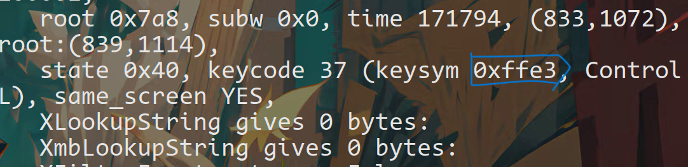
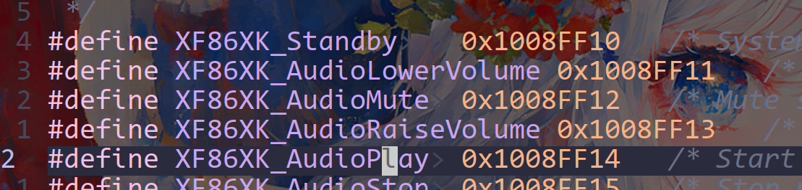
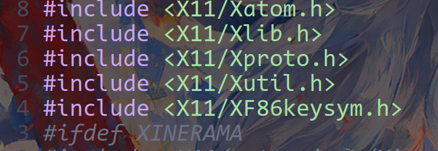

# 第一部分安装声音与亮度工具

arch+dwm中

首先是安装声音和亮度的工具这里用的是alsa和light

```shell
sudo pacman -S alsa alsa-utils light
```


# 1、声音部分

安装之后可以通过alamixer打开声音控制的图形界面

也可以用amixer来调整

这里我们用amixer来调整

```shell
amixer sset Master 5%+ unmute (音量加)
amixer sset Master 5%- unmute (音量减)
amixer sset Master toggle (静音切换)
```


我这里不知道为什么关闭Master的时候Speacker也会一起静音所以我这里静音切换用

```shell
amixer sset Master toggle && amixer sset Speacker unmute
```


我们可以用shell脚本来设置也可以直接在dwm的配置中设置，这里我们直接去改配置就行

首先要确定我们的笔记本键盘的功能键在linux中的名称比如

```shell
我这里是
Fn+F6 (音量加)
Fn+F5 (音量减)
Fn+F4 (静音切换)
```


先打开一个终端输入命令`xev`可以看到一个空白输入当按下Fn+F6（有些笔记本可能不需要加Fn就是功能键，看个人的bios设置，可能Fn+F1=F1也有可能Fn+F1=对应功能，根据自己笔记本去按就可以l）

当按下之后可以看到终端中显示出如下的结果我们主要看keysym之后的十六进制数即可我这里按下Fn+F6（音量加）显示的是（keysym 0x1008ff13, 截图错了）我们根据这个数去查找名称






我们可以去`/usr/include/X11/XF86keysym.h`头文件中查看

```shell
vim /usr/include/X11/XF86keysym.h

```


打开之后搜索（/）x1008ff13





这里可以看到按键名称在数值前面,我这里Fn+F6就是XF86XK_AudioRaiseVolume

之后我们去dwm的文件加中设置即可

首先需要在dwm.c文件中添加`#include <X11/XF86keysym.h>`(注意是dwm.c中不是drw)





然后打开dwm的配置文件`vim config.h`

中按键设置的位置添加

```c
	{ 0, XF86XK_AudioRaiseVolume,  spawn, SHCMD("amixer sset Master 2%+ unmute") },
	{ 0, XF86XK_AudioLowerVolume,  spawn, SHCMD("amixer sset Master 2%- unmute") },
	{ 0, XF86XK_AudioMute,         spawn, SHCMD("amixer sset Master toggle && amixer sset Speaker unmute") },
```

之后保存推出然后`sudo make clean install`重新进入即可


# 2、亮度部分

亮度调整用的是light

使用之前需要把我们当前用户添加到video组中

`sudo usermod -a -G video username`(这里username换成直接的用户名)

添加之后就可以用light了我们这里常用的参数有三个

```shell
light -A 数值 （增加百分之xx）
light -U 数值 （减少百分之xx）
light -S 数值 （设置到百分之xx）
```


和上面声音同理得到按键的名称之后直接去dwm的配置文件中config.h写入

```c
{ 0, XF86XK_MonBrightnessUp,   spawn, SHCMD("light -A 2") },
{ 0, XF86XK_MonBrightnessDown, spawn, SHCMD("light -U 2") },
```

之后`sudo make clean install`重新进入即可


**注意**这里用的是笔记本自带的键盘外界键盘有些有驱动可以修改，有些没有官方驱动修改起来是比较麻烦的
