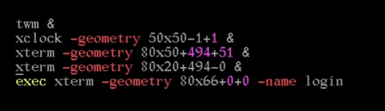
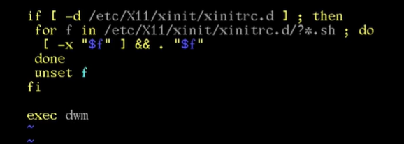
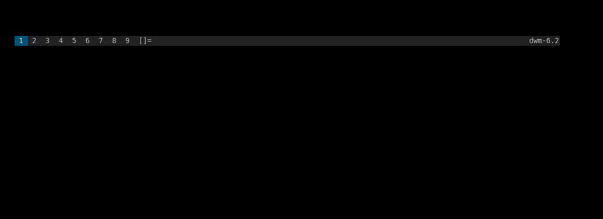
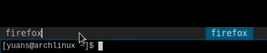
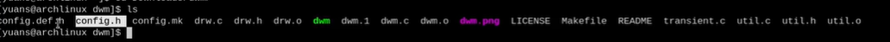
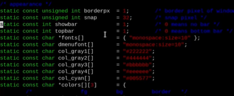
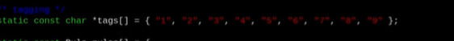
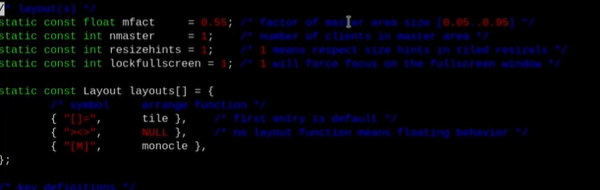
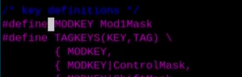
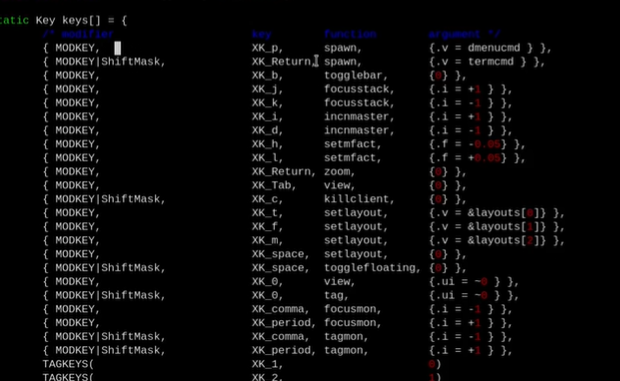

  ## suckless三件套

## 下载安装

由于是安装到U盘里面的所以我们不用桌面环境用更为简洁高效的dwm

窗口管理器，这个是由[suckless](https://suckless.org/)这个组织开发维护的，源代码是C语言写的中共才不到两千行

首先我们创建一个文件夹夹专门放dwm（窗口管理器）以及st（终端）dmenu（启动）

重启之后我们就可以用用户名密码登录了

```suckless
sudo pacman -S git（如果没有安装git的话需要安装一下）
mkdir suckless
cd suckless
git clone https://git.suckless.org/dwm
git clone https://git.suckless.org/st
git clone https://git.suckless.org/dmenu
git clone https://git.suckless.org/slstatus
```

说是三件套多安装了一个slstatus有了后面配置状态栏的

```suckless
cd dwm
sudo make clean install
cd ..
cd st
sudo make clean install
cd ..
cd dmenu
sudo make clean install
cd ..
cd slstatus
sudo make clean install
```

到这里就将dwm+st+dmenu三个下载安装完成了

这里还需要安装一下启动所需要的软件

`sudo pacman -S xorg-xinit（如果刚刚没有安装的话这里要安装上`

`sudo pacman -S udisks2 udiskie pcmanfm`（U盘以及图形的文件管理器）

`sudo pacman -S feh`（背景图片）

之后将xinit的配置文件复制到用户目录xx

`cp /etc/X11/xinit/xinitrc ~/.xinitrc`

`sudo vim .xinitrc`





将文件最后的这几行都删掉改为`exec dwm`





保存退出即可

这个时候我们用命令`startx`就可以进入dwm了


## 2. dwm使用





进入dwm之后就可以看到类似的界面了

可以用alt+shift+回车（enter）打开终端st

alt+shift+c关闭窗口

dwm的三种模式alt+t（平铺模式）以及alt+f（浮动模式）以及alt+m（最大化）还有一些alt+j、k左右窗口中移动以及alt+h、l调整左右窗口大小等等

以及其他用法可以自行上网看一看视频这里并不好描述

或者去看配置文件后面会讲到


## dmenu

按alt+p可以看见上面会弹出dmenu了输入程序名称即可打开

按esc退出dmenu

比如我们这里用火狐浏览器举例

`sudo pacman -S firefox`

首先安装firefox

安装好后alt+p打开dmenu输入firefox可以看到右边会出现可以用tab补全之后回车（enter）即可打开浏览器alt+shift+c关闭






## 配置文件

进入dwm的文件夹可以看到





confi.def.h和config.h就是配置文件

打开那个都可以config.h是由config.def.h来的建议去直接更改config.def.h

有`sudo vim config.def.h`打开配置文件

### 第一部分 外观





这里可以看到最开头是一些外观有关的以及字体这里咱们先不改等打完补丁没有问题之后在进行修改

### 第二部分标签





这里的1~9就是左上角的一些东西我们可以根据自己的需要更改

比如我们第一个桌面要打开终端就可以把1改为terminal，第二个桌面打开文件就可以把2改为file等等或者改为其他的小图标等等

### 第三部分 模式





这里可以看到三种模式[]=和><>和[M]三种模式也可以自己修改

比如把[]=改为平铺把><>改为浮动可能更好理解一些

这里我就不做修改了


### 第四部分 按键





这里我们可以看到一个modkey默认是Mod1Mask这个是alt我们一般是改为Mod4Mask就是我们的win键

以后就可以使用win+shift+回车（enter）打开终端以及win+p打开dmenu等

就是将alt用win替换了因为在有一些应用中alt可能有一些别的左右所以我们用win键替换、





再往下面就是按键的一些说明比如第一行MODKEY	xk_p

就是win+p打开dmenu

第二行MODKEY|ShiftMask	xk_Return 就是win+shift+回车（就是return）打开terminal就是终端了

可以根据习惯自己更改

更改完毕之后就可以：wq保存退出了

如果报错的话有可能是没有权限看看有没有用sudo vim

之后我们将config.h删除由于我们是直接修改的config.def.h所以需要重新生成config.h文件`sudo rm -r config.h`删除config.h之后

`sudo make clean install`重新安装即可

我们用alt+shift+q退出dwm

再次输入`startx`进入dwm配置就更改完成了看看win+shift+回车（enter）有没有生效
