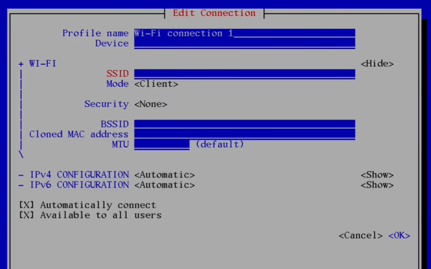
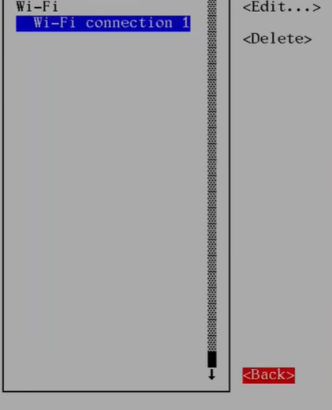
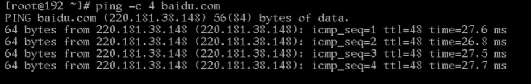
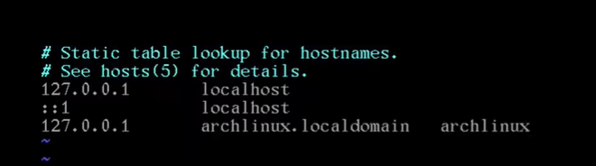
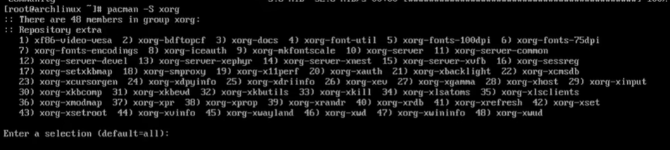
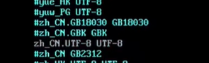
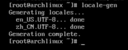
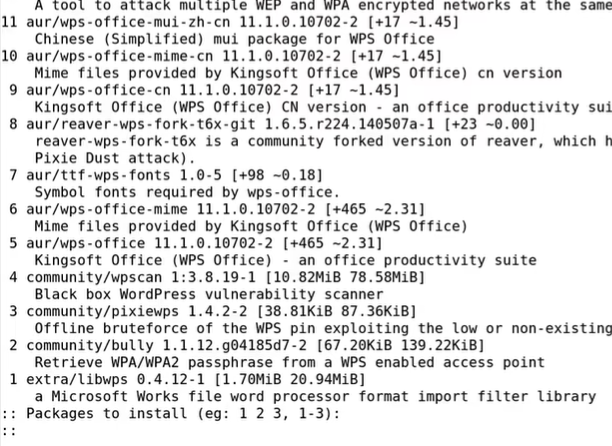
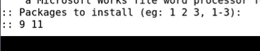

# arch的基础设置

## 1. 进入系统

接上一篇输入用户名root以及密码之后就可以进入系统了




可以看到@后面是192这是默认的系统名称下面进行更改


## 2. 连接网络

输入`nmtui`打开网络界面




第一个选项




用方向键将光标移动到add添加一个网络，如果是网线的话在左边可以看到



 

第一行（Profile name）填写wifi的名称（随意就可以）

第二行（Device）写无线网卡的名称（可以在终端中用`ip addr`查看默认是wlan0也有可能不一样）

第三行（SSID）才是要连接的wifi的名称比如CMCC-xxx-5G

第四行（Mode）默认

第五行（Security）按回车（enter）用wpa这个就可以




之后输入密码




输入密码之后直接ok就可以其他的不用动了





之后左边就可以看到wifi了一路返回就可以了

退出之后可以用`ping -c 4 baidu.com`测试一下





如果出现连接时间就说明以及连接成功了

之后`pacman -Syy`同步一下就可以了


## 3. 重命名主机名称

输入命令`vim /etc/hostname`

进入之后按a进行输入名字可以随意这里就用archlinux了，起一个直接喜欢的名字即可建议不要太长




之后按esc退出输入模式然后输入（冒号保存退出）:wq即可之后重启就会生效了，这里就先不重启了先进行下一步

将主机地址进行映射

`vim /etc/hosts`（可以用tab补全这个文件是已经存在在系统里面了）





第一行输入127.0.0.1按一个tab键localhost

第二行两个冒号：：1两个tab键localhost

第三行这里注意是127.0.1.1一个tab键加上刚刚的主机名称和localdomain

应该是`127.0.1.1	archlinux.localdomain	archlinux`

保存退出即可


## 4. 设置时间

`timedatectl set-timezone Asia/Shanghai`

第一步设置时区大陆的代表地区是亚洲上海注意不是北京（可以用tab补全）

`timedatectl set-ntp true`

第二步打开网络同步

之后用`timedatectl status`查看一下时间




确定时间正确即可


## 5. 添加普通用户

root的用户的权限太大了所以要添加一个普通的用户并且生成一个用户文件夹

`useradd --create-home 用户名`

创建之后可以用`id 用户名`查看用户

再用`passwd 用户名`给用户添加一个密码

添加好后还需要将用户添加到组里面才可以用sudo命令提权

`usermod -aG wheel,users,storage,power,lp,adm,opticla 用户名`

添加好后可以用`ip 用户名`查看一下




之后还需要修改一个文件

`export EDITOR=vim`

之后用`viduso`




进入文件之后往下找找到%whell




将%whell这一行去掉注释（就是将#删除）之后保存退出即可

这一步之后重启一下即可


## 6. xorg的安装

`pacman -S xorg`





这个组里面包含了很多东西如果觉得太多了话可以安装`xorg-server`

我这里就全部安装了

`pacman -S xorg xorg-xinit`

回车（enter）下载即可


## 7. 字体安装

字体的话就一次性安装完，包括中英文的一下常用字体

1. 安装之前首先生成一下系统的字体

   `vim /etc/locale.gen`

   进去之后用`/`进入搜索模式输入en_US.UTF-8

   

   

   找到后将utf-8的英文字体去注释即可

   然后esc退出输入模式用`/`进入搜索模式输入zh_CN

   

   

   将中文的utf-8格式的字体也去注释

   保存退出即可

   `vim /etc/locale.conf`进入之后输入一句话

   

   

   也可以用`LANG=zn_CN.UTF-8`不过先不建议生成中文可能出现乱码

   这里我们就用`LANG=en_US.UTF-8`就行

   之后保存退出

   用`locale-gen`命令生成即可

   

   

2. 安装字体

   （这里也可以用tab补全）

   `pacman -S ttf-dejavu ttf-droid ttf-font-awesome otf-font-awesome ttf-lato ttf-liberation ttf-linux-libertine ttf-opensans ttf-roboto ttf-ubuntu-font-family`

这一写是跟英文有关常用的字体接下来是中文的字体如果不按照中文字体在比如浏览器看到中文的时候可能会出现乱码

`pacman -S ttf-hannom noto-fonts noto-fonts-extra noto-fonts-emoji noto-fonts-cjk adobe-source-code-pro-fonts adobe-source-sans-fonts adobe-source-serif-fonts adobe-source-han-sans-cn-fonts adobe-source-han-sans-hk-fonts adobe-source-han-sans-tw-fonts adobe-source-han-serif-cn-fonts wqy-zenhei wqy-microhei`

安装即可，建议用tab键补全手打的容易打错

之后打开渲染据说能媲美苹果的字体

`vim /etc/porfile.d/freetype2.sh`

打开后将最后一行去注释即可




保存退出


## 8. 显卡驱动

显卡里面住院分为三类intel和amd以及N卡

1. intel

   `pacman -S Vulkan-intel mesa`

   这里不建议安装xf86-video-intel这个官网有说明为什么

2. amd

   `pacman -S mesa vulkan-radeon`

3. N卡

   `pacman -S nvidia nvidia-settings nvidia-utils`

N卡的话安装这几个也不一定行，因为N卡的驱动在linux并不是很友好

有一些型号是需要自己去官网下载的


## 9. 声音系统

`pacman -S alsa-utils pulseaudio pulseaudio-bluetooth`

之后就可以用alsamixer设置声音了以及一下蓝牙音响所需要的

蓝牙后面会讲到


## 10. 添加aur

这里常用的是yay但是paru更新一些所以这里咱们用最新的paru

由于paru需要用git安装所以先下载git

`pacman -S git`

`git clone https://aur.archlinux.org/paru.git`

克隆之后cd到paru的目录里面

这里需要用到makepkg我们先去配置一下

`vim /etc/makepkg.conf`

找到MAKEFLAGS=这一行改为`MAKEFLAGS="j$(nproc)"`




保存退出即可之后在paru文件夹在执行`makepkg -si`

网速过慢可能下载不到需要好一点的网络

安装好后就可以使用paru了

比如`paru wps`

就可以用paru来安装wps

和pacman很类似

这里我们简单配置一下`vim /etc/paru.conf`之后将BottomUp




选项去注释一下，可将相关性高的放在下面离近一些

修改完后保存退出即可

这里用wps举例子输入`paru wps`





我们一般安装的是第9个和第11个中文版和wps的中文的字体

我们输入9 11就可以了





回车（enter）即可，安装之前会显示一下脚步里面写的是什么我们按一下q退出就可以，按Y选择安装就行，之后wps就安装好了，但是我们现在还使用不了后面会说到


## 11. 添加软件源

一般常用的软件源有清华或者中科大的这里我们用清华的

软件源里面包含了一下非官方但是常用的一些软件

`vim /etc/pacman.conf`

往下找找到官方的几个源




在下面加上清华的源

```源
[archlinux]
Server = https://mirrors.tuna.tsinghua.edu.cn/archlinux/$arch
```

之后保存退出即可

之后安装`pacman -S archlinuxcn-keyring`

`pacman -Syy`同步一下就可以看到清华的源了




之后重启即可
