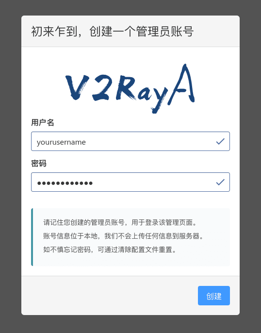
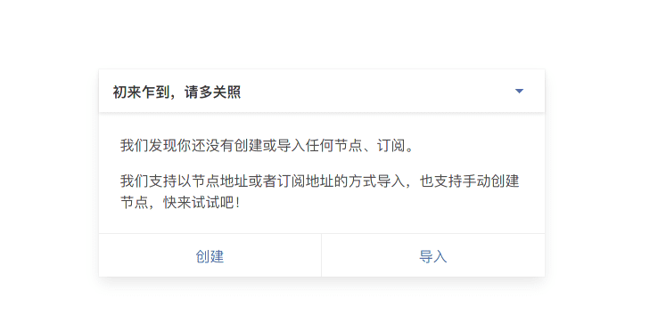
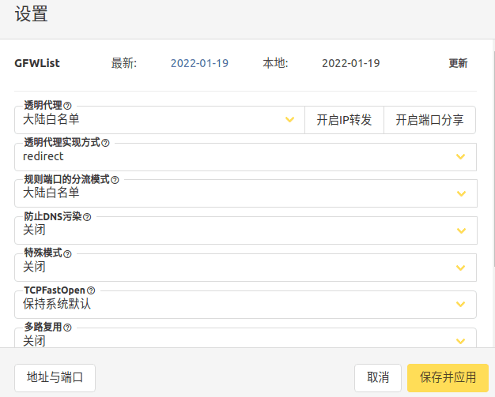

# 1、科学上网

由于后续在使用中肯定涉及网络问题所以要先把网络连接上。

这里使用的是v2rayA





1、 首先需要v2ray内核

```zsh
sudo pacman -S v2ray
安装完之后并不需要，所以我们关闭服务就行
sudo systemctl disable v2ray --now
```

2、之后安装v2rayA

也非常简单`sudo pacman -S v2raya`

然后启动即可

```zsh
sudo systemctl start v2raya.service
sudo systemctl enable v2raya.service
```

v2rayA的设置ui是网页形式的，我们用火狐如果没有的话安装一下`sudo pacman -S firefox`，然后打开浏览器，访问v2rayA的配置地址http://localhost:2017/

第一次进入需要设置用户名以及密码如果忘记密码的话可以删除重新下载或者用命令`sudo v2raya --reset-password`

之后根据提示导入订阅节点





设置可以用官方推荐的设置





设置好地址与端口就可以正常使用了
