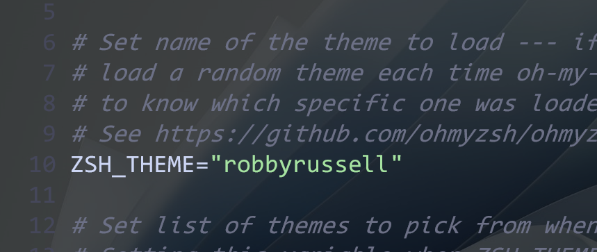
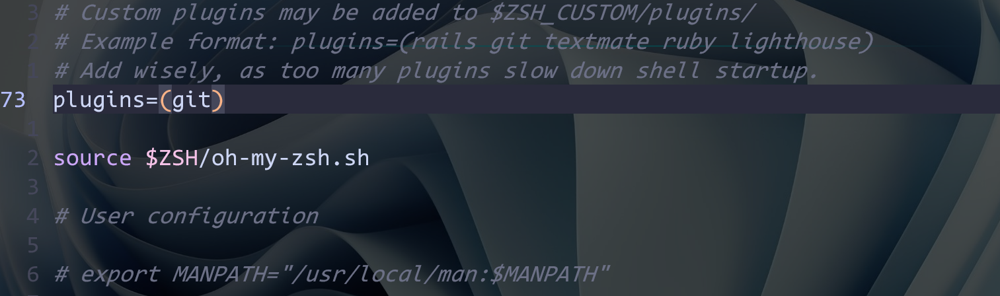

# 一、安装zsh以及oh-my-zsh

## 1、zsh安装

zsh的话就不多说了，有很多的自定义选项，并支持扩展。可以实现更强大的命令补全，命令高亮等一系列酷炫功能。但是zsh配置起来有一些麻烦所以我们借助oh-my-zsh去直接配置。

首先我们需要安装zsh非常简单`sudo pacman -S zsh`就可以


## 2、oh-my-zsh安装

oh-my-zsh的官网给出了两种方式安装https://ohmyz.sh/

第一种是用curl

`sh -c "$(curl -fsSL https://raw.githubusercontent.com/ohmyzsh/ohmyzsh/master/tools/install.sh)"`

第二种是用wget

`sh -c "$(wget https://raw.githubusercontent.com/ohmyzsh/ohmyzsh/master/tools/install.sh -O -)"`

不过两种方式都差不多主要看网络好不好，如果按上一篇或者配置好，科学上网的话是没有问题的，要不然会报错。


所以我们有第二种方法

可以直接去github克隆下来

```bash
git clone https://github.com/robbyrussell/oh-my-zsh.git ~/.oh-my-zsh、
之后复制配置文件到家目录下面
cp ~/.oh-my-zsh/templates/zshrc.zsh-template ~/.zshrc
最后吧zsh改成默认的shell
chsh -s /bin/zsh
```


# 二、zsh美化

之后用编辑器（vim或者vscode等都可以）打开zsh的配置文件`sudo vim .zshrc`找到里面这一行





这里的robbyrussell就是主题名称，可以换成ys等，改完之后重新进入终端或者执行 source ~/.zshrc 命令就会发现zsh的主题就变了。

# 三、ohmyzsh插件

oh-my-zsh是可以安装插件的，有一些自带有一些需要自己安装一下





找到这一行比如git就是原本就有的，如果添加写到后面就可以了

plugins=（插件A  插件B  插件C）

zsh的插件有很多这里介绍几个我常用的

## 1、git

git里面添加了很多git的alias这是个zsh自带的

## 2、z

这个也是zsh自带的，我们把它放到plugins里面就可以用来跳转或者移动autojump也可以不过autojump需要安装ctrl+r也可以

## 3、sudo

偶尔输入某个命令，提示没有权限，需要加sudo，这个时候按两下ESC，就会在命令行头部加上sudo

## 4、zsh-autosuggestions

## 5、zsh-syntax-highlighting

这两个几乎是zsh必备插件人手一个，一个是自动补全历史命令，会记录你之前输入过的所有命令，并且自动匹配你可能想要输入命令，然后按→补全；另一个是高亮正确命令，命令太多，有时候记不住，等输入完了才知道命令输错了，这个插件直接在输入过程中就会提示你，当前命令是否正确，错误红色，正确绿色

不过这两个插件需要手动安装

```zsh
git clone https://github.com/zsh-users/zsh-autosuggestions ${ZSH_CUSTOM:-~/.oh-my-zsh/custom}/plugins/zsh-autosuggestions

git clone https://github.com/zsh-users/zsh-syntax-highlighting.git ${ZSH_CUSTOM:-~/.oh-my-zsh/custom}/plugins/zsh-syntax-highlighting
```


zsh的插件非常非常的多，这两就放几个常用的，可以根据自己的使用情况加上比如sublime或者vscode等对应的插件。
