# 第一部分 fcitx5输入法的安装

## 1. fcitx5安装

`sudo pacman -S fcitx5-im fcitx5-chinese-addons fcitx5-material-color`

安装即可这里面包含了fcitx5本体以及中文包以及模仿微软的一个皮肤

这个时候我们有win+p打开dmenu输入fcitx5-config（就是fcitx5的配置ui）



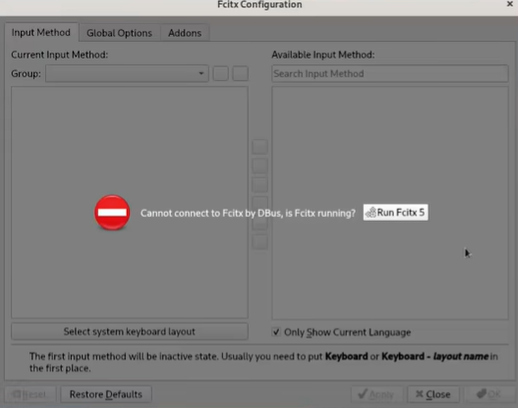

第一次打开会出现这个因为我们还没有启用fcitx5我们直接点击run fcitx5启动即可之后



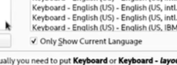

将这个选项去掉，这个是只显示英文的一些键盘，取消之后我们就可以看到中文的了



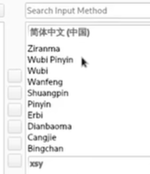

我们要用到的就是Pinyin我们双击就可以了



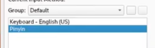

这个时候就可以看到左边已经被添加进来了

我们可以用ctrl+space（空格）打开fcitx5以及中英文切换

我们还需要去`sudo vim /etc/environment`在后面添加

```fcitx5
GTK_IM_MODULE=fcitx
QT_IM_MODULE=fcitx
XMODIFIERS=@im=fcitx
SDL_IM_MODULE=fcitx
GLFW_IM_MODULE=ibus
```

之后需要重启一下才可以

重启登录之后输入startx进入dwm

我们win+dmenu打开firefox然后用ctrl+space打开fcitx5可以看到一个拼

说明fcitx5以及到了拼音模式输入中文试一下应该就可以输入中文了

## 2. 配置字库

### 1. 云字库

首先我们win+p打开dmenu之后输入fcitx5-xxx进入配置程序



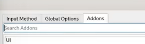

选择addons 



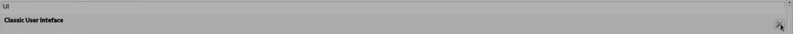



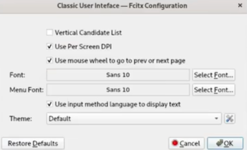

第一行最右边点开可以在这个里面可以设置字体的大小我们可以调大一些



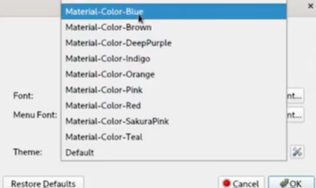

我们可以看到最后面的主题里面有我们刚刚安装的一些主题选一个自己喜欢的就行之后点击ok即可

也可以去aur中找更多的主题

之后我们往下滑找到Pinyin的选项



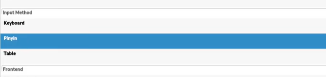



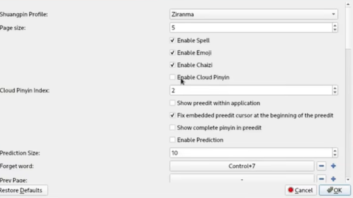

打开之后我们可以看见enable cloud  pinyin启用云拼音

之后我们往下找到



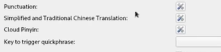

点击cloud pinyin这一行



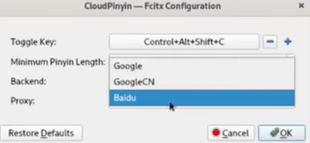

我们将其改为baidu之后OK即可云拼音就设置成功了


### 2. 本地字库

我们安装一些字库

`sudo pacman -S fcitx5-pinyin-zhwiki fcitx5-pinyin-moegirl`

安装好之后就可以使用了


# 第二部分 背景图片

这里我们安装一个壁纸和壁纸软件以及混合器

`sudo pacman -S feh picom archlinux-wallpaper`

当然这里也可以使用自己喜欢的壁纸咱们后面再说

这里的archlinux-wallpaper会放在/usr/share/backgrouds/archlinux文件夹下，也可以自己创建一个文件夹放自己喜欢的壁纸

之后用`feh --bg-fill --randomize /usr/share/backgrounds/archlinux/* `

回车（enter）之后就可以看到壁纸了（看不到的话可能是终端挡住了我们用win+2切换到第二个桌面就可以看到了）

这里的archlinux可以改成自己的壁纸文件夹可以把\*换成指定的壁纸名称如果是\*号的话就是整个文件夹随机选取


之后我们去修改一下启动文件

`sudo vim ~/.xinitrc`

在最下面写上

```.xinitrc
fcitx5 &
feh --bg-fill --randomize /usr/share/backfrounds/archlinux/*
picom -b
exec slstatus
exec dwm
```


最后我们开始的时候安装了udisks2的U盘识别的软件我们需要开机启动一下

`sudo systemctl enable udisks2`

重启即可
