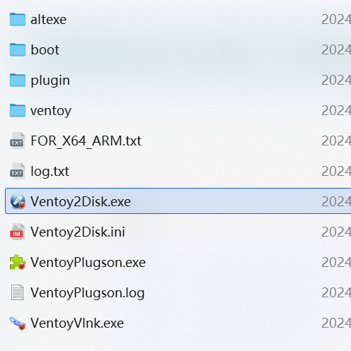
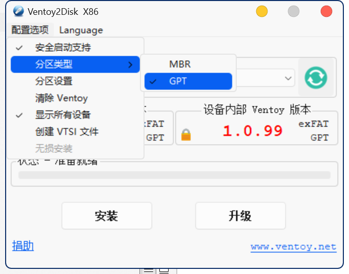
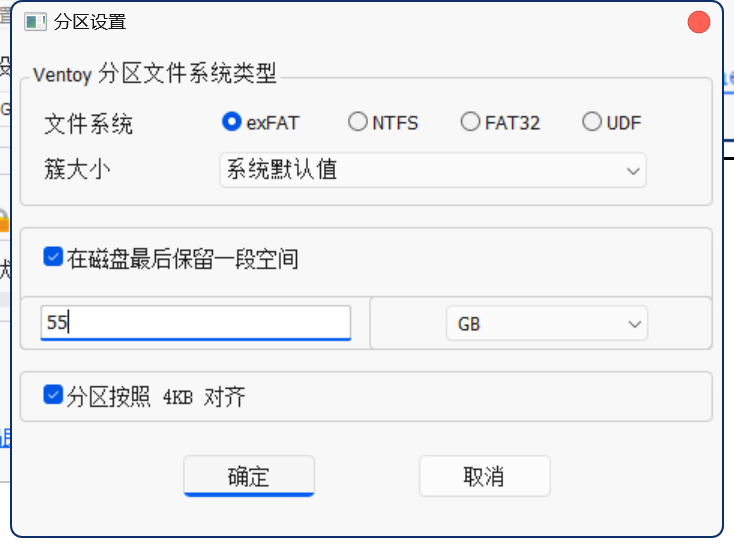
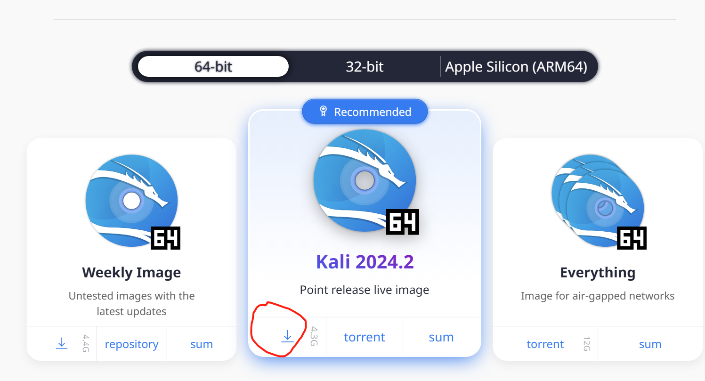
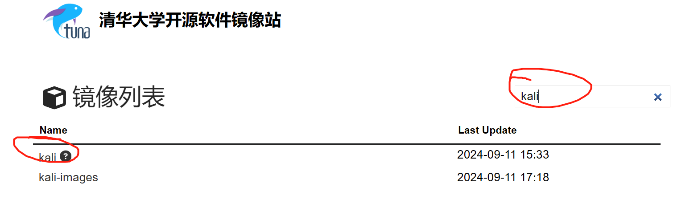
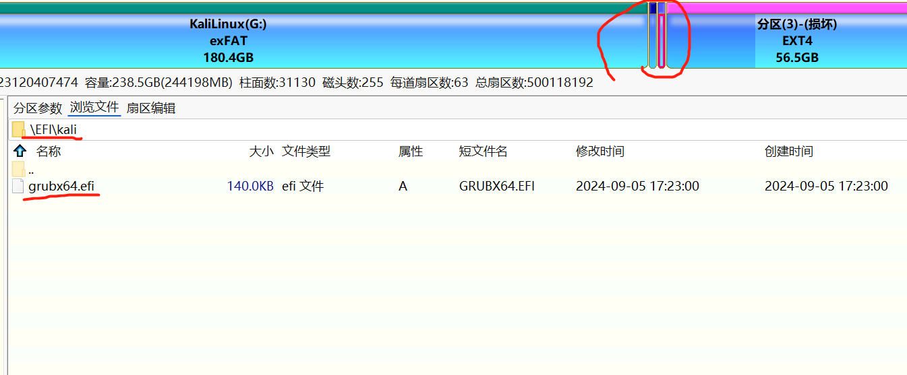
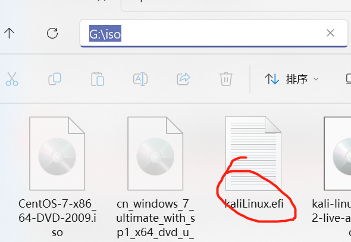
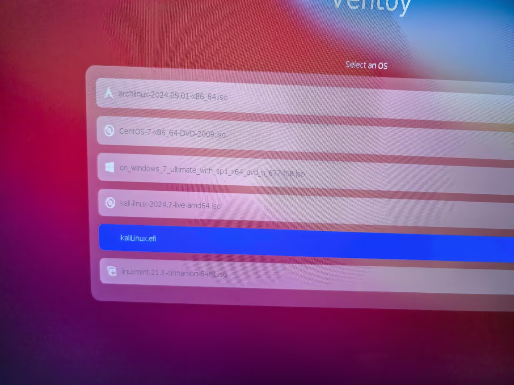
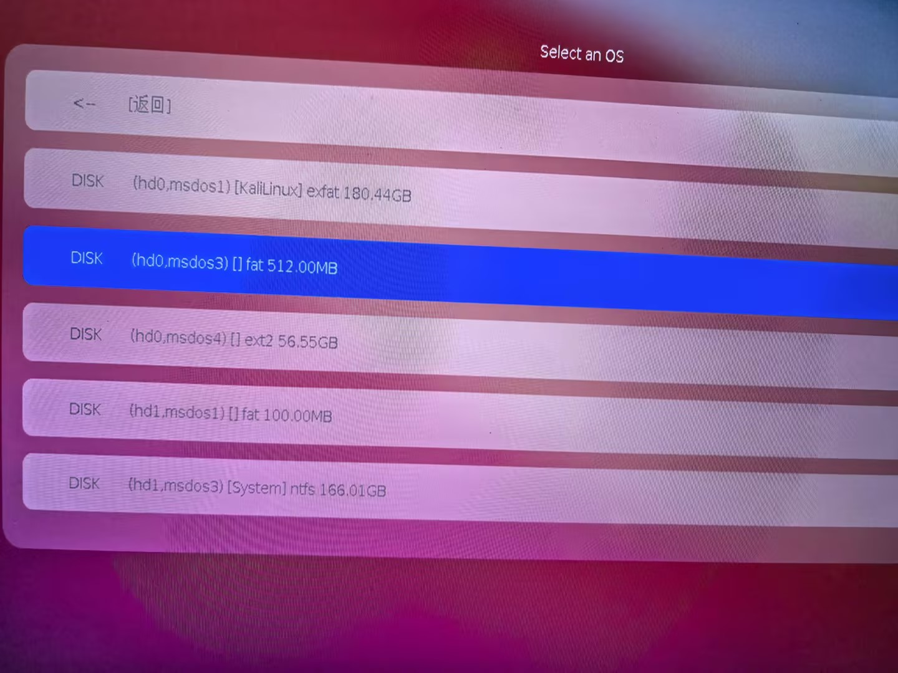
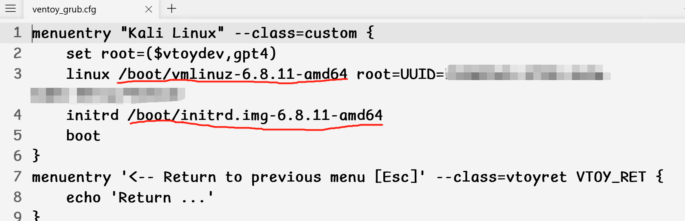

# kali-linux安装到U盘中

## 前言

由于手上正好有一个固态U盘，还有一些时间，就决定折腾一下kali，俗话说的好kali学的好，入狱入的早

但是又不想用虚拟机装kali第一是性能问题风扇噪音太大，第二是总感觉怪怪的。所以就直接把kali装到固态U盘里，相当于半个实体机安装了。优点就是便携，缺点就是换系统需要重启，看个人需求吧。

## 1、准备工作

1、首先要准备一个高速U盘或者固态硬盘（固态+硬盘盒）都可以，速度快一点就行，我这里用的是移速的512gb固态U盘还是挺不错的

2、将U盘分好区安装好ventoy

3、准备一个kali的iso

## 2、安装ventoy

首先去ventoy的官网https://www.ventoy.net/cn/download.html下载一个ventoy然后插入u盘运行

**运行之前务必确保U盘中没有重要资料**

**运行之前务必确保U盘中没有重要资料**

**运行之前务必确保U盘中没有重要资料**

然后分区类型建议选gpt，分区设置可以根据U盘大小在后面留出大概五六十GB的空间给kali系统

这样的话前面的空间还是可以当正常U盘来使用的

之后安装即可

## 3、准备kali安装镜像

我们可以直接去kali的官网下载https://www.kali.org/get-kali/#kali-platforms

选择最常用的版本就行

但是kali官网下载十分的慢，有两种解决方法第一种可以利用工具下载，或者我们直接去清华的开源软件镜像站下载

https://mirrors.tuna.tsinghua.edu.cn/

我们选择合适的版本下载即可

之后将下载好的iso放入安装完ventoy的U盘中可以在里面创建一个iso文件夹将所有的iso文件都放到里面

## 4、安装kali系统

所有准备工作做好之后就可以开始安装kali了，重启电脑进入biso模式（每个品牌电脑不一样一般是开机的时候频繁的按F12）

之后通过安装ventoy的U盘启动，启动之后就可以看见我们刚刚下载的kali的iso镜像了，我们选择正常启动就行进入kali

进入kali之后U盘版本的iso默认是live正常启动类似于windows的pe，不能保存数据不能永久化，我们选择第三个还是第四个install，安装的方式打开，然后就和windows安装一样了，基本上一直下一步就行，这里注意的是kali安装是需要联网的，笔记本的话有可能是找不到网卡驱动的，这里最简单直接的办法就是插网线（超级省事）

基本流程就是先选择语言->地区->键盘

然后就是网络地址可以空着

名字可以随便写

然后是域名也可以随便写

然后创建用户名以及密码

之后就是分区，分区的时候要注意，我们选择自定义，然后选择我们刚刚U盘留出来的内一部分，之后用默认分区就行（一般就是一个efi，一个主分区，一个swap）然后就一直yes就OK了

## 5、从U盘中启动kali

刚安装好之后的kali默认是会从kali的efi引导启动，但是之后的话正常的电脑是会默认从windows启动的，也就是说不会影响我们主系统的使用的。

安装好之后如果进入biso从U盘启动的话默认用的是ventoy的引导，这里的话有三种解决方案（推荐第三种）

### 第一种

第一种方式比较简单就是直接把efi文件放到ventoyU盘的iso文件夹中，在windows中利用（DiskGenius工具)将正常应该是第三个分区中的efi文件复制到桌面然后改个名字再放入U盘的iso文件夹中

之后通过U盘启动的方式直接选择这个文件即可

### 第二种

第二种方法的话什么都不用改，每次从U盘启动的时候按F2手动去找这个efi文件也是可以的

一般就是这个512MB的分区选择里面的/EFI/xxx.efi文件即可

### 第三种

以上两种方式的实际使用过程中会有一些问题，就是如果换了一台电脑很容易找不到系统直接进入grub

第三种方式稍微复杂一点

需要我们在U盘中创建一个ventoy的文件夹

里面创建一个ventoy_grub.cfg的配置文件

配置文件中将UUID改成自己kali根目录主分区的uuid

然后再kali系统里面看一下/boot/里面这两个文件的具体名称换一下自己对应的名称即可

之后通过U盘启动然后按F6即可进入自定义菜单

我们直接选择kali linux启动即可
